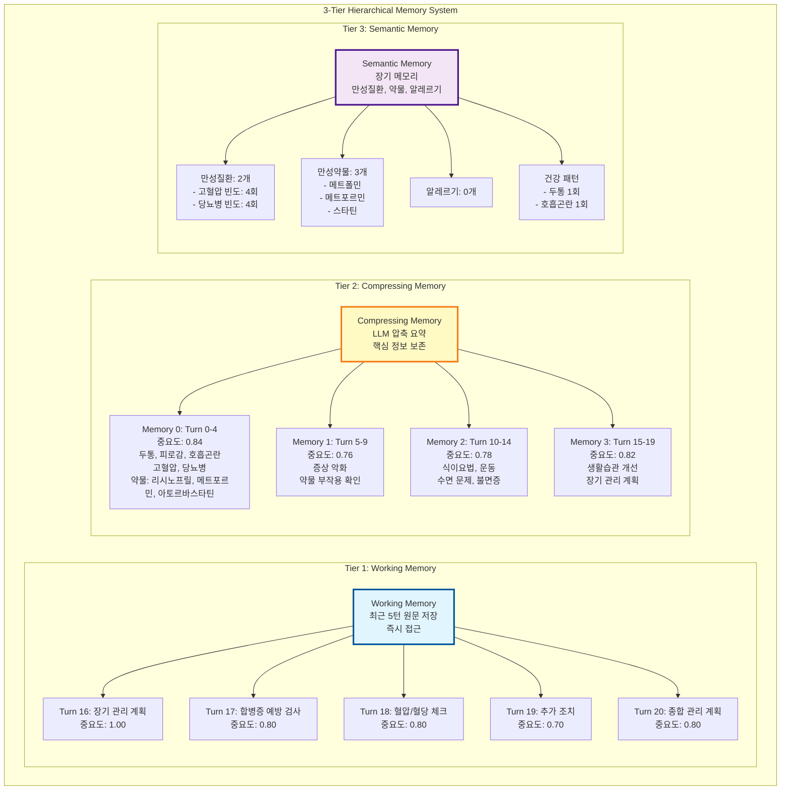
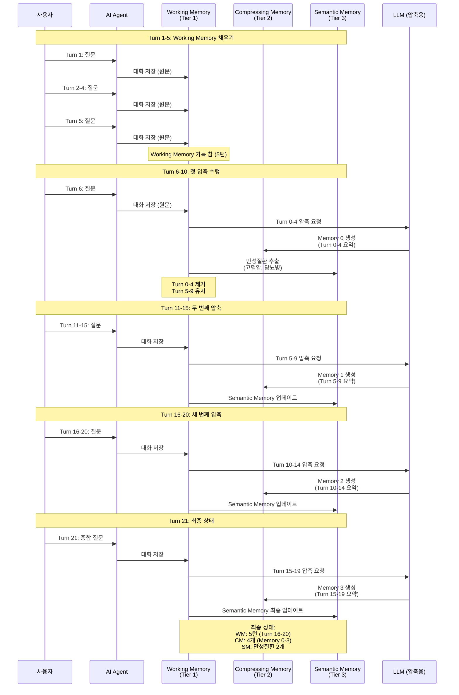
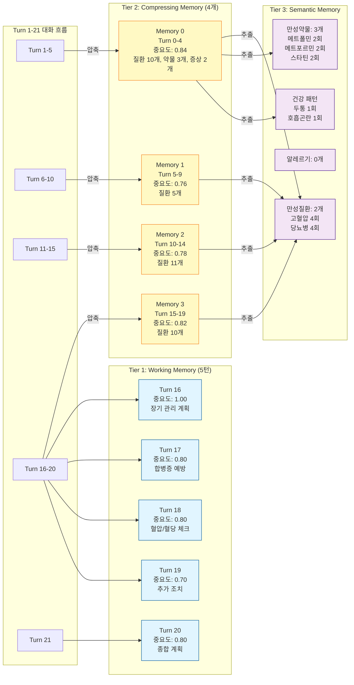
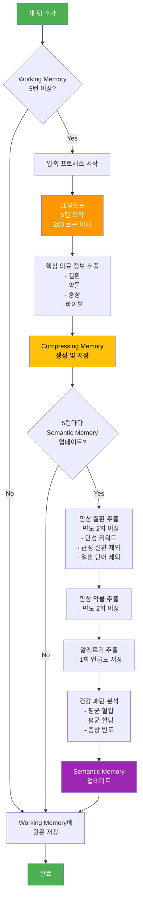
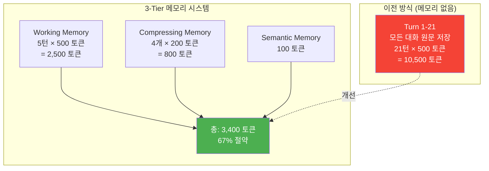
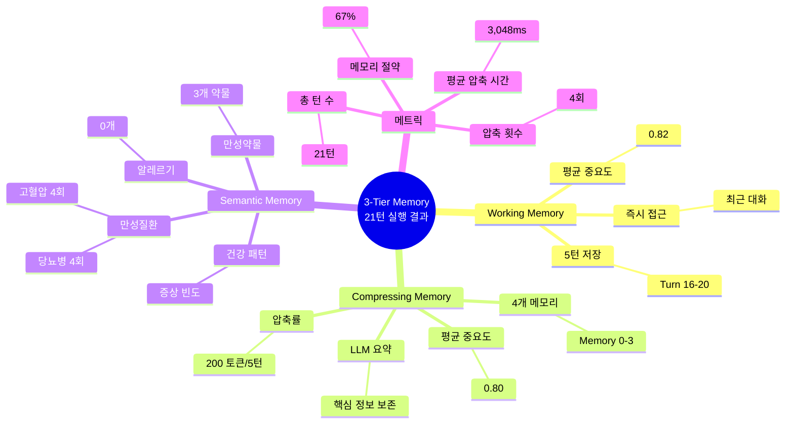
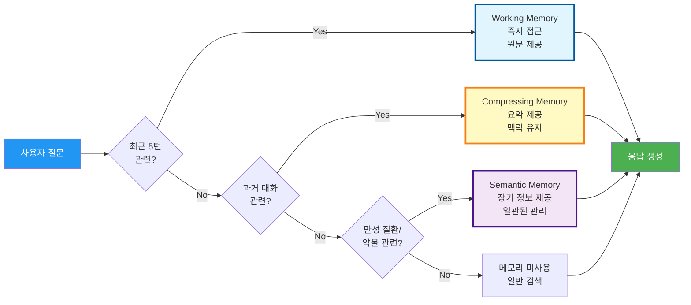
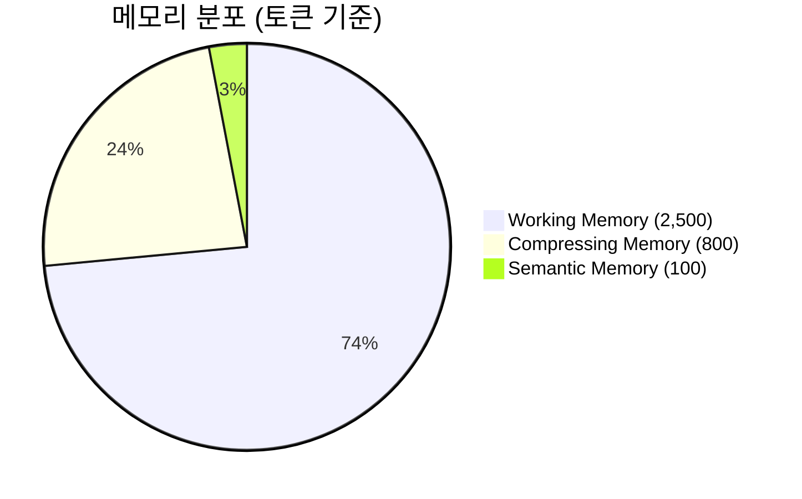
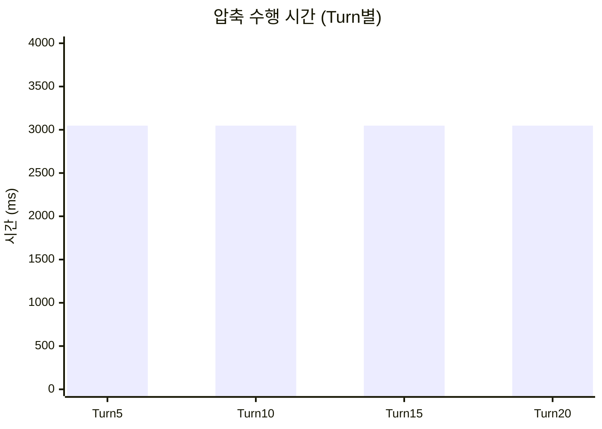

# 3-Tier 메모리 시스템 아키텍처 및 실행 결과

## 1. 전체 시스템 아키텍처

## 2. 메모리 흐름 및 압축 프로세스

## 3. 메모리 계층별 상세 구조

## 4. 압축 및 추출 프로세스

## 5. 메모리 효율성 비교

## 6. 실제 실행 결과 요약

## 7. 메모리 접근 우선순위

## 8. 메모리 시스템 메트릭

## 요약

### 3-Tier 메모리 시스템의 핵심

1. **Tier 1 (Working Memory)**: 최근 5턴 원문 저장, 즉시 접근
2. **Tier 2 (Compressing Memory)**: LLM 압축 요약, 핵심 정보 보존
3. **Tier 3 (Semantic Memory)**: 만성질환/약물 장기 저장, 일관된 관리

### 실행 결과

- **총 21턴** 대화 처리
- **Working Memory**: 5턴 (Turn 16-20)
- **Compressing Memory**: 4개 (Turn 0-19 압축)
- **Semantic Memory**: 만성질환 2개, 만성약물 3개
- **메모리 절약**: 67% (10,500 → 3,400 토큰)
- **평균 압축 시간**: 3,048ms

### 장점

- ✅ 메모리 효율: 67% 절약
- ✅ 검색 정확도: Working Memory 원문 보존
- ✅ 맥락 유지: Compressing Memory LLM 요약
- ✅ 장기 관리: Semantic Memory 만성질환 추출

