# Medical AI Agent 아키텍처 다이어그램

이 문서는 현재 스캐폴드의 LangGraph 기반 구조와 Corrective RAG (CRAG) 메커니즘을 시각화합니다.

---

## CRAG 내부 루프 vs LangGraph 외부 루프 (요약)
- **외부 루프 (LangGraph 매크로 플로우)**: `extract_slots → store_memory → assemble_context → retrieve → generate_answer → refine → quality_check` 순서로 세션 상태를 관리하며 멀티턴 컨텍스트, 메모리, 라우팅을 담당합니다.
- **내부 루프 (CRAG Self-Refine 마이크로 루프)**: `generate_answer → refine → quality_check → retrieve`의 반복으로 단일 턴 품질을 보정합니다. 기능 플래그로 on/off하며 최대 반복 수를 제한합니다.
- **실험용 기능 플래그** (`config/agent_config.yaml`):
  - `self_refine_enabled`: 내부 루프 on/off
  - `max_refine_iterations`: 내부 루프 반복 한계
  - `dynamic_rag_routing`: 질문 유형별 인덱스 라우팅 on/off
  - `medcat2_enabled`: MedCAT2 기반 사용자 정보 추출 on/off
  - `memory_mode`: `structured`(기본) / `none` (메모리 미사용 ablation)
  - `query_rewrite_enabled`: 슬롯·프로필을 반영한 질의 재작성 on/off
- **라벨과 코드 연결**:
  - 매크로 플로우: `agent/graph.py`, `agent/nodes/*`
  - 마이크로 루프: `refine_node` + `quality_check_node`에서 반복 제어
  - 라우팅·재작성: `retrieve_node`에서 슬롯 기반 라우팅 + 질의 재작성
  - 메모리: `store_memory_node` + `memory/profile_store.py` (구조화 슬롯)

---

## 1. 전체 워크플로우 (LangGraph 노드 및 엣지)

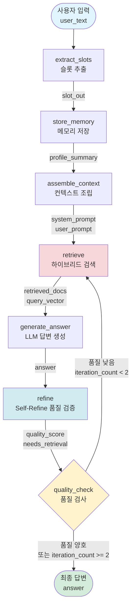

---

## 2. Corrective RAG (CRAG) 순환 구조 상세

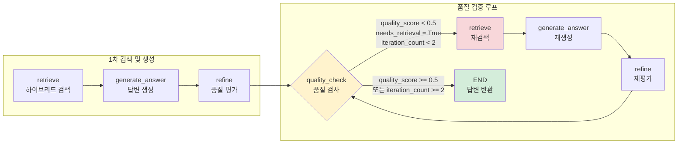

---

## 3. AgentState 상태 흐름

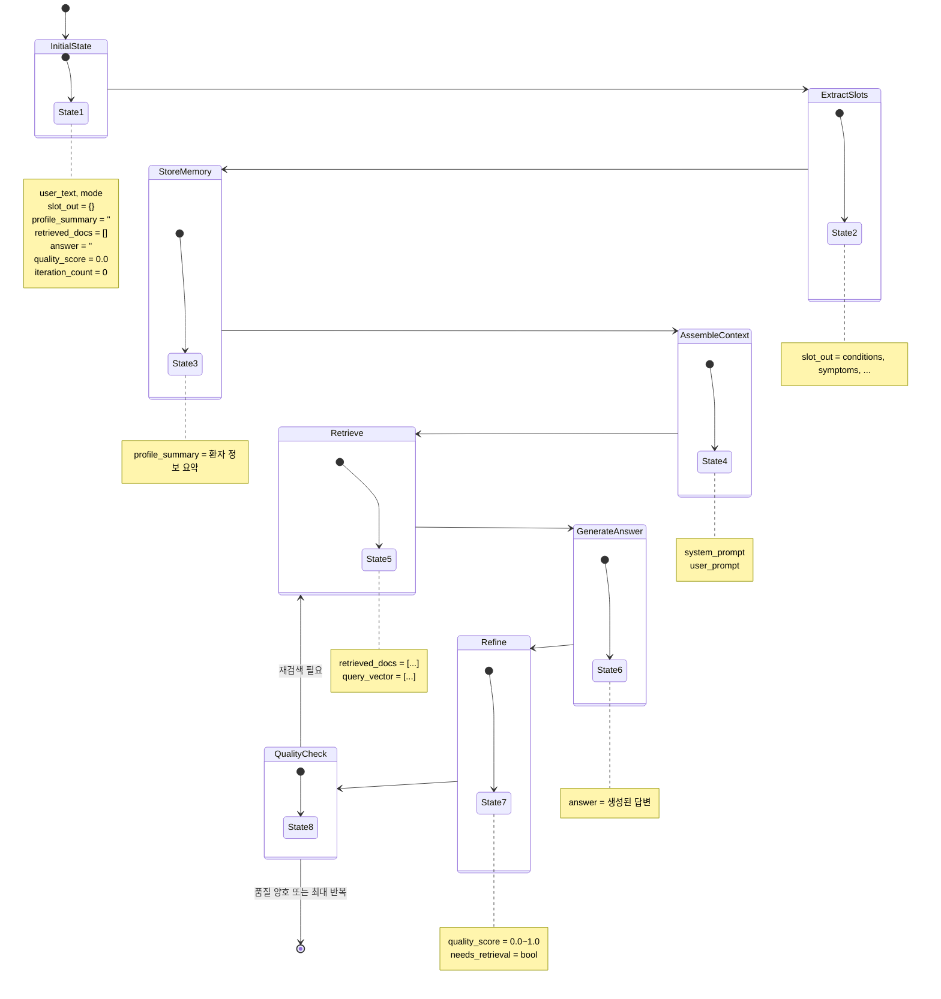

---

## 4. 하이브리드 검색 구조 (retrieve 노드 내부)

### 4.1 전체 하이브리드 검색 파이프라인

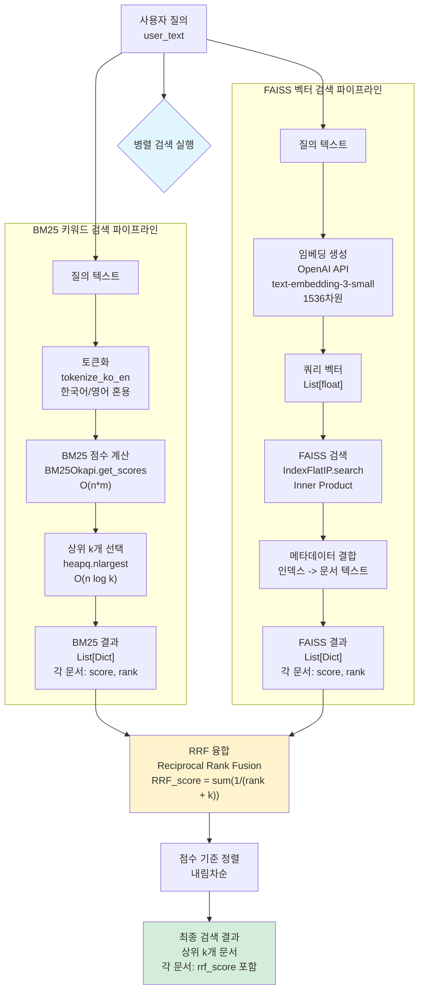

### 4.2 BM25 검색 상세 프로세스

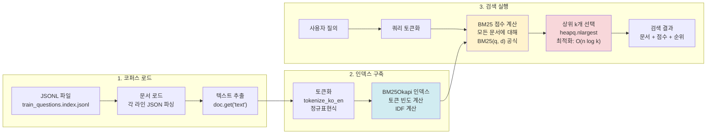

### 4.3 FAISS 검색 상세 프로세스

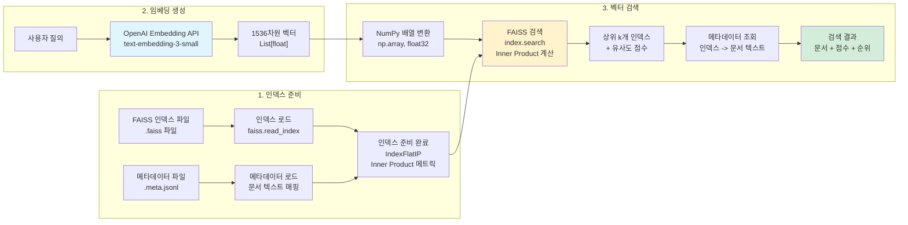

### 4.4 RRF 융합 알고리즘 상세

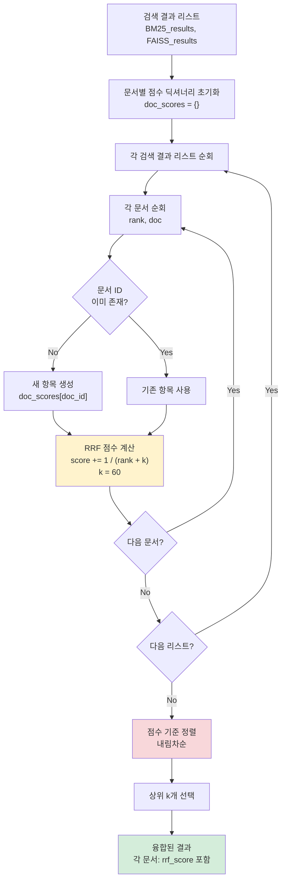

### 4.5 RRF 점수 계산 예시

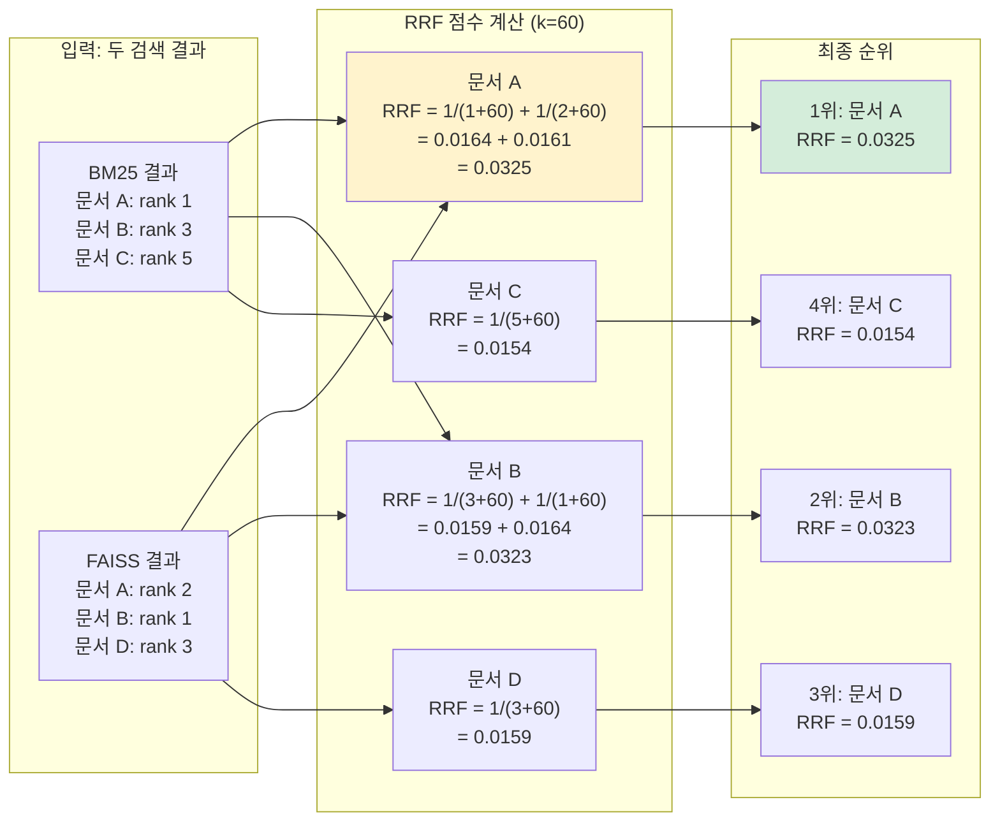

---

## 5. 모드별 분기 처리 (LLM vs AI Agent)

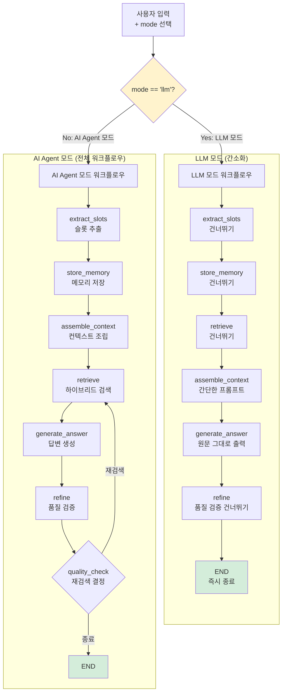

---

## 6. Context Engineering 4단계 프로세스

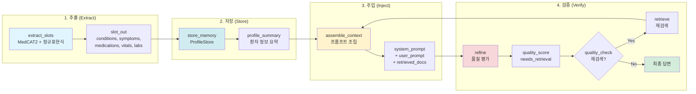

---

## 7. Self-Refine 메커니즘 상세

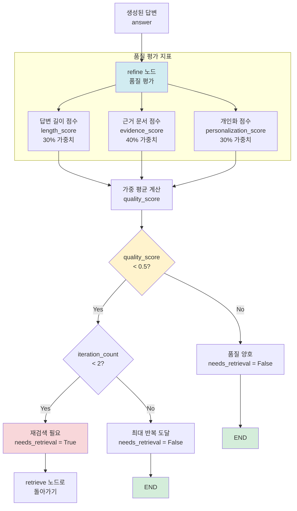

---

## 8. 전체 시스템 아키텍처 (고수준)

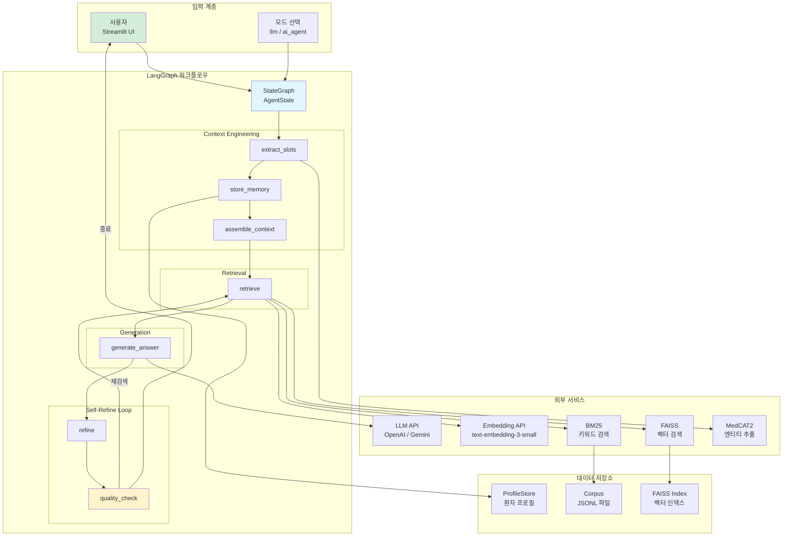

---

## 9. 노드별 입출력 데이터 흐름

```mermaid
graph LR
    subgraph INPUT["입력"]
        IN["user_text: str<br/>mode: str"]
    end
    
    subgraph EXTRACT["extract_slots"]
        E_IN[user_text] --> E["MedCAT2 추출<br/>정규표현식 매칭"]
        E --> E_OUT["slot_out:<br/>conditions, symptoms,<br/>medications, vitals, labs"]
    end
    
    subgraph STORE["store_memory"]
        S_IN[slot_out] --> S["ProfileStore<br/>업데이트"]
        S --> S_OUT["profile_summary:<br/>환자 정보 요약"]
    end
    
    subgraph ASSEMBLE["assemble_context"]
        A_IN1[profile_summary] --> A[프롬프트 조립]
        A_IN2[retrieved_docs] --> A
        A_IN3[user_text] --> A
        A --> A_OUT["system_prompt<br/>user_prompt"]
    end
    
    subgraph RETRIEVE["retrieve"]
        R_IN[user_text] --> R1[임베딩 생성]
        R1 --> R2[BM25 검색]
        R1 --> R3[FAISS 검색]
        R2 --> R4[RRF Fusion]
        R3 --> R4
        R4 --> R_OUT["retrieved_docs:<br/>List[Dict]"]
    end
    
    subgraph GENERATE["generate_answer"]
        G_IN1[system_prompt] --> G[LLM API 호출]
        G_IN2[user_prompt] --> G
        G --> G_OUT["answer: str"]
    end
    
    subgraph REFINE["refine"]
        RF_IN1[answer] --> RF[품질 평가]
        RF_IN2[retrieved_docs] --> RF
        RF_IN3[profile_summary] --> RF
        RF --> RF_OUT["quality_score: float<br/>needs_retrieval: bool"]
    end
    
    subgraph QUALITY["quality_check"]
        QC_IN["quality_score<br/>needs_retrieval<br/>iteration_count"] --> QC{"조건 판단"}
        QC --> QC_OUT1["retrieve<br/>재검색"]
        QC --> QC_OUT2["END<br/>종료"]
    end
    
    IN --> E_IN
    E_OUT --> S_IN
    S_OUT --> A_IN1
    R_OUT --> A_IN2
    A_OUT --> G_IN1
    A_OUT --> G_IN2
    G_OUT --> RF_IN1
    R_OUT --> RF_IN2
    S_OUT --> RF_IN3
    RF_OUT --> QC_IN
    QC_OUT1 --> R_IN
    
    style QC fill:#fff3cd
```

---

## 10. Corrective RAG 루프 시퀀스 다이어그램

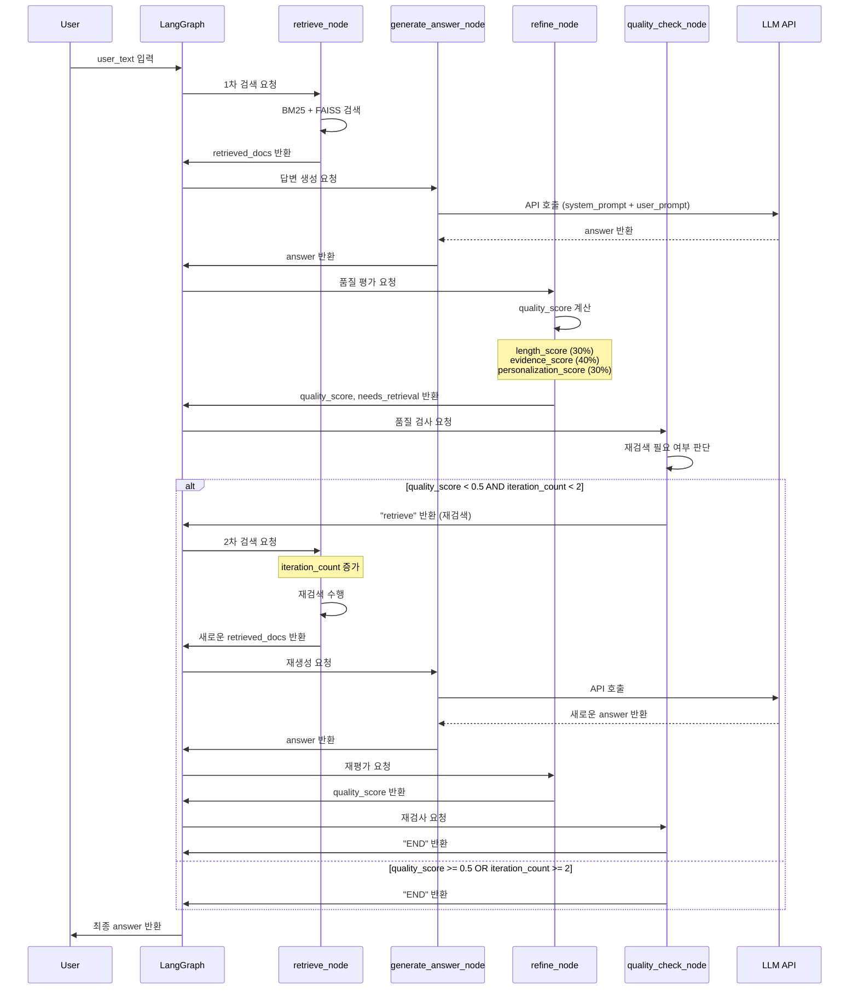

---

## 11. 하이브리드 검색 상세 설명

본 시스템의 하이브리드 검색에 대한 상세한 기술적 설명은 **`HYBRID_RETRIEVAL_DETAILED.md`** 파일을 참조하세요.

해당 문서에는 다음 내용이 포함되어 있습니다:
- BM25 알고리즘의 수학적 배경 및 구현
- FAISS 벡터 검색의 메커니즘
- RRF 융합 알고리즘의 상세 설명
- 성능 특성 및 복잡도 분석
- 실제 코드 흐름 및 예시

---

## 다이어그램 사용 가이드

### Mermaid 렌더링 방법

1. **GitHub/GitLab**: 마크다운 파일에 자동 렌더링
2. **VS Code**: Mermaid 확장 프로그램 설치
3. **온라인**: [Mermaid Live Editor](https://mermaid.live/)
4. **로컬**: `npm install -g @mermaid-js/mermaid-cli`

### 주요 개념 설명

- **노드 (Node)**: LangGraph의 처리 단위, 각 노드는 AgentState를 받아서 업데이트된 상태를 반환
- **엣지 (Edge)**: 노드 간의 데이터 흐름, 순차적 또는 조건부
- **조건부 엣지**: `quality_check` 노드에서 반환값에 따라 다음 노드 결정
- **순환 구조**: `retrieve → generate → refine → quality_check → retrieve` 루프
- **Self-Refine**: 답변 품질이 낮으면 자동으로 재검색 및 재생성

---

**작성일**: 2025-01-XX  
**버전**: 1.0

