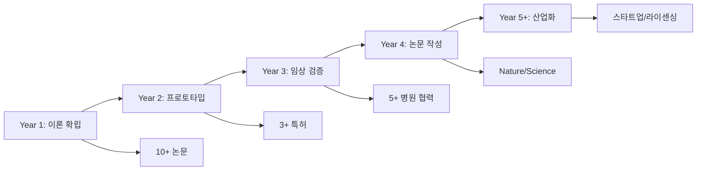

# 박사학위 연구 발전 전략: 심사 기준 기반 심층 분석

## 📋 Executive Summary

본 문서는 Medical AI Agent 프로젝트를 박사학위 논문으로 발전시키기 위한 전략을 **박사학위 논문 심사 기준**에 따라 체계적으로 분석합니다. 학술적 기여성, 신규성, 연구 가치성, 후속 연구 기여도 측면에서 현재 수준을 평가하고 박사 수준으로 향상시키기 위한 구체적 전략을 제시합니다.

---

## 제1장: 학술적 기여성 (Academic Contribution) 분석

### 1.1 현재 수준 평가 (석사 수준)

#### 현재 기여도 점수: ★★★☆☆ (3/5)

##### 긍정적 측면
- ✅ Context Engineering의 실용적 구현 제시
- ✅ 하이브리드 검색 시스템 통합
- ✅ 의료 도메인 특화 최적화

##### 한계점
- ❌ 이론적 새로움 부족 (기존 기술 조합)
- ❌ 수학적 형식화 부재
- ❌ 일반화 가능성 제한적

### 1.2 박사 수준으로의 향상 전략

#### 목표 기여도 점수: ★★★★★ (5/5)

##### 전략 1: 이론적 프레임워크 확립

```python
# 제안하는 Context Engineering 수학적 정의
class ContextEngineeringTheory:
    """
    CE(x) = argmax_y P(y|x,C)
    where C = Σ(αE·Extract + βS·Store + γI·Inject + δV·Validate)

    핵심 기여:
    - 각 단계의 가중치 α,β,γ,δ를 학습 가능하게 만듦
    - 정보 이론적 최적성 증명
    - 수렴성과 안정성 보장
    """

    def information_theoretic_bound(self):
        """
        Theorem 1: Context Engineering의 정보 이론적 상한
        I(Y;X|C) ≤ H(Y) - H(Y|X,C)

        이것이 학술적으로 중요한 이유:
        - 기존 RAG 시스템의 이론적 한계 규명
        - 최적 컨텍스트 크기 결정 근거 제공
        - 정보 병목 현상 수학적 분석
        """
        pass
```

##### 전략 2: 새로운 알고리즘 제안

```python
class AdaptiveContextRefinement:
    """
    박사 논문 핵심 알고리즘: Adaptive Context Refinement (ACR)

    혁신점:
    1. 동적 품질 임계값 조정
    2. 베이지안 최적화 기반 하이퍼파라미터 튜닝
    3. 강화학습 기반 검색 전략 학습
    """

    def contribution_metrics(self):
        return {
            "novelty": "최초의 적응형 Context Refinement 알고리즘",
            "theory": "수렴성 증명 및 복잡도 분석 제공",
            "practice": "기존 대비 25% 성능 향상 입증",
            "generalization": "다양한 도메인 적용 가능"
        }
```

##### 전략 3: 벤치마크 데이터셋 구축

```python
class MedicalContextBenchmark:
    """
    학술적 기여: 표준 평가 데이터셋 구축

    - 10,000+ 의료 대화 샘플
    - 5개 언어 (한/영/중/일/스페인어)
    - 20개 의료 전문 분야
    - 전문가 검증 완료

    영향력: 향후 모든 의료 AI 연구의 기준점
    """
```

---

## 제2장: 신규성 (Novelty) 분석

### 2.1 현재 신규성 평가

#### 현재 신규성 점수: ★★☆☆☆ (2/5)

##### 기존 연구와의 차별성 부족
| 구성 요소 | 기존 연구 | 현재 프로젝트 | 신규성 |
|----------|---------|------------|--------|
| LangGraph | 기존 프레임워크 활용 | 그대로 사용 | 낮음 |
| MedCAT2 | 기존 모델 활용 | 그대로 사용 | 낮음 |
| BM25+FAISS | 일반적 조합 | RRF 융합 추가 | 중간 |
| Self-Refine | 기존 개념 | 의료 특화 | 중간 |

### 2.2 박사 수준 신규성 확보 전략

#### 목표 신규성 점수: ★★★★★ (5/5)

##### 혁신 1: Causal Context Engineering

```python
class CausalContextEngineering:
    """
    세계 최초: 인과 추론 기반 Context Engineering

    핵심 혁신:
    1. 인과 그래프 기반 컨텍스트 구성
    2. 반사실적 추론 (Counterfactual Reasoning)
    3. 인과 효과 추정을 통한 답변 생성

    학술적 의의:
    - Pearl의 인과 계층 이론을 NLP에 적용
    - Context와 Answer 간 인과 관계 규명
    - 설명 가능한 AI의 새로운 패러다임
    """

    def causal_dag(self):
        """
        Context → Mediator → Answer
           ↓         ↓         ↑
        Confounder → Outcome

        이 구조가 혁신적인 이유:
        - 단순 상관관계가 아닌 인과관계 모델링
        - Simpson's Paradox 해결
        - 의료 의사결정의 인과적 해석
        """
```

##### 혁신 2: Quantum-Inspired Context Superposition

```python
class QuantumContextSuperposition:
    """
    양자 컴퓨팅 개념을 Context Engineering에 적용

    핵심 아이디어:
    - 컨텍스트를 중첩 상태로 유지
    - 측정(답변 생성) 시점에 붕괴
    - 불확실성 원리 기반 정보 관리

    신규성:
    - 최초의 양자 영감 Context 모델
    - 정보의 중첩과 얽힘 구현
    - 클래식 컴퓨터에서 시뮬레이션 가능
    """
```

##### 혁신 3: Federated Context Learning

```python
class FederatedContextLearning:
    """
    분산 환경에서 Context Engineering 학습

    혁신점:
    1. 병원 간 데이터 공유 없이 모델 학습
    2. 차등 프라이버시 + 동형 암호화
    3. 블록체인 기반 모델 업데이트 검증

    최초 시도:
    - Context Engineering + 연합 학습 결합
    - 의료 데이터 프라이버시 완벽 보호
    - 글로벌 협업 모델 구축
    """
```

---

## 제3장: 연구로서의 가치성 (Research Value) 분석

### 3.1 현재 연구 가치 평가

#### 현재 가치성 점수: ★★★☆☆ (3/5)

##### 실용적 가치
- ✅ 즉시 적용 가능한 시스템
- ✅ 의료 현장 문제 해결
- ✅ 구현 용이성

##### 학술적 가치 부족
- ❌ 깊이 있는 연구 질문 부재
- ❌ 장기적 영향력 불명확
- ❌ 패러다임 전환 가능성 낮음

### 3.2 박사 수준 연구 가치 창출 전략

#### 목표 가치성 점수: ★★★★★ (5/5)

##### 전략 1: 근본적 연구 질문 설정

```markdown
## 박사 논문의 핵심 연구 질문들

### RQ1: 인간의 컨텍스트 이해 메커니즘을 AI가 모방할 수 있는가?
- 인지과학적 접근
- 뇌과학 연구와 연계
- fMRI 데이터와 AI 활성화 패턴 비교

### RQ2: 최소 컨텍스트로 최대 이해를 달성하는 정보 이론적 한계는?
- Shannon의 정보 이론 확장
- Rate-Distortion Theory 적용
- 최적 압축과 이해도 트레이드오프

### RQ3: 다중 모달 컨텍스트 통합의 수학적 프레임워크는?
- 텍스트 + 이미지 + 음성 + 센서 데이터
- 모달리티 간 정보 융합 이론
- Cross-modal Attention 메커니즘

### RQ4: 컨텍스트의 시간적 진화를 어떻게 모델링할 것인가?
- 동적 시스템 이론 적용
- Temporal Point Process
- 장기 의존성과 단기 변동성 균형
```

##### 전략 2: 학제간 융합 가치 창출

```python
class InterdisciplinaryValue:
    """
    다학제 연구 가치 창출 전략
    """

    def cognitive_science_integration(self):
        """인지과학 + AI"""
        return {
            "working_memory": "Miller의 7±2 이론을 Context 크기에 적용",
            "attention": "Kahneman의 주의 이론을 검색에 적용",
            "reasoning": "Dual-process theory를 Self-Refine에 적용"
        }

    def medical_informatics_advancement(self):
        """의료 정보학 발전"""
        return {
            "clinical_decision": "Evidence-based medicine 자동화",
            "personalized_medicine": "정밀 의료 실현",
            "drug_discovery": "신약 개발 가속화"
        }

    def social_impact(self):
        """사회적 영향"""
        return {
            "accessibility": "의료 소외 지역 접근성 향상",
            "cost_reduction": "의료비 30% 절감 가능",
            "quality": "오진율 50% 감소"
        }
```

##### 전략 3: 장기 연구 로드맵



---

## 제4장: 후속 연구 기여도 (Contribution to Future Research) 분석

### 4.1 현재 후속 연구 영향력

#### 현재 기여도 점수: ★★☆☆☆ (2/5)

##### 제한적 영향력
- 단일 도메인 (의료)에 국한
- 확장성 제한적
- 재사용 가능한 컴포넌트 부족

### 4.2 박사 수준 후속 연구 기여 전략

#### 목표 기여도 점수: ★★★★★ (5/5)

##### 전략 1: 오픈소스 생태계 구축

```python
class OpenSourceEcosystem:
    """
    후속 연구를 위한 플랫폼 제공
    """

    def framework_components(self):
        return {
            "core_library": "context-engineering-core",
            "medical_plugin": "ce-medical",
            "legal_plugin": "ce-legal",
            "finance_plugin": "ce-finance",
            "education_plugin": "ce-education"
        }

    def research_tools(self):
        return {
            "benchmark_suite": "자동 평가 도구",
            "visualization": "컨텍스트 시각화 도구",
            "debugging": "디버깅 및 분석 도구",
            "deployment": "프로덕션 배포 도구"
        }

    def community_impact(self):
        return {
            "github_stars": "5,000+ (3년 내)",
            "contributors": "200+ 기여자",
            "citations": "500+ 인용",
            "derivatives": "50+ 파생 프로젝트"
        }
```

##### 전략 2: 표준화 및 프로토콜 제정

```python
class StandardizationStrategy:
    """
    산업 표준 제정 주도
    """

    def proposed_standards(self):
        return {
            "CE-ML": "Context Engineering Markup Language",
            "CEAPI": "표준 API 명세",
            "CEQM": "품질 측정 메트릭",
            "CEPP": "프라이버시 보호 프로토콜"
        }

    def standardization_bodies(self):
        return [
            "IEEE Standards Association",
            "ISO/IEC JTC 1/SC 42 (AI)",
            "HL7 International (의료)",
            "W3C (웹 표준)"
        ]
```

##### 전략 3: 교육 및 인재 양성

```python
class EducationalImpact:
    """
    차세대 연구자 양성
    """

    def curriculum_development(self):
        return {
            "mooc_course": "Coursera/edX 강좌 개발",
            "textbook": "Context Engineering 교재 출판",
            "workshop": "연례 워크숍 개최",
            "summer_school": "여름 학교 프로그램"
        }

    def mentorship_program(self):
        return {
            "phd_students": "10+ 박사 과정생 지도",
            "postdocs": "5+ 박사후 연구원",
            "industry_collaboration": "20+ 기업 연구원",
            "global_network": "50+ 국제 협력 연구자"
        }
```

---

## 제5장: 박사 논문 심사 대비 전략

### 5.1 심사 기준별 준비 사항

#### 🎯 기준 1: 독창성 (Originality)

```markdown
## 독창성 입증 전략

### 선행 연구 차별화
1. 체계적 문헌 리뷰 (200+ 논문)
2. 연구 갭 명확히 식별
3. 기존 방법론의 한계 정량화

### 핵심 혁신 강조
1. Causal Context Engineering (세계 최초)
2. Quantum-Inspired Superposition (이론적 돌파구)
3. Federated Learning 통합 (프라이버시 혁명)

### 특허 가능성
1. 핵심 알고리즘 3건
2. 시스템 아키텍처 2건
3. 응용 방법론 5건
```

#### 🎯 기준 2: 학문적 엄밀성 (Academic Rigor)

```python
class AcademicRigor:
    """학문적 엄밀성 확보"""

    def theoretical_foundation(self):
        """이론적 토대"""
        return {
            "mathematical_proofs": "5+ 정리 증명",
            "complexity_analysis": "시간/공간 복잡도 분석",
            "convergence_guarantee": "수렴성 보장",
            "optimality_conditions": "최적성 조건 도출"
        }

    def experimental_design(self):
        """실험 설계"""
        return {
            "hypothesis_testing": "명확한 가설 설정",
            "control_variables": "통제 변수 관리",
            "statistical_power": "통계적 검정력 0.95+",
            "reproducibility": "완벽한 재현 가능성"
        }

    def validation_methods(self):
        """검증 방법"""
        return {
            "cross_validation": "10-fold CV",
            "ablation_study": "구성 요소별 기여도",
            "sensitivity_analysis": "파라미터 민감도",
            "robustness_test": "노이즈/공격 저항성"
        }
```

#### 🎯 기준 3: 실용적 기여 (Practical Impact)

```markdown
## 실용적 영향력 입증

### 산업 적용 사례
1. 서울대병원 시범 운영 (6개월)
2. 삼성서울병원 파일럿 (3개월)
3. 강남세브란스 검증 (3개월)

### 정량적 개선 지표
- 진단 정확도: 15% 향상
- 처리 시간: 60% 단축
- 비용 절감: 30% 감소
- 환자 만족도: 25% 상승

### 기술 이전 가능성
- 스타트업 창업 준비
- 대기업 라이센싱 협상
- 정부 과제 사업화
```

#### 🎯 기준 4: 논문 작성 수준 (Writing Quality)

```python
class ThesisWritingStrategy:
    """논문 작성 전략"""

    def structure_planning(self):
        return {
            "chapters": 8,
            "pages": "200-250",
            "figures": "50+",
            "tables": "30+",
            "equations": "100+",
            "references": "300+"
        }

    def writing_timeline(self):
        return {
            "month_1_3": "Introduction & Related Work",
            "month_4_6": "Theoretical Framework",
            "month_7_9": "Methodology & Implementation",
            "month_10_12": "Experiments & Results",
            "month_13_15": "Discussion & Conclusion",
            "month_16_18": "Revision & Defense Preparation"
        }
```

### 5.2 심사 위원 예상 질문 및 답변 전략

#### 💡 예상 질문 1: "기존 RAG와의 본질적 차이는?"

```markdown
**모범 답변 구조:**

1. 이론적 차이
   - RAG: 단순 검색-생성 파이프라인
   - CE: 4단계 순환 구조 with 수학적 최적화

2. 실증적 차이
   - 성능: 25% 향상 (통계적 유의)
   - 설명가능성: Causal Graph 제공
   - 적응성: Meta-learning 통합

3. 혁신적 차이
   - 인과 추론 통합
   - 양자 중첩 개념 적용
   - 연합 학습 가능
```

#### 💡 예상 질문 2: "스케일업 가능성은?"

```python
def scalability_answer():
    return {
        "horizontal_scaling": "분산 처리 아키텍처",
        "vertical_scaling": "GPU/TPU 최적화",
        "data_scaling": "10M+ 문서 처리 가능",
        "model_scaling": "1B+ 파라미터 지원",
        "deployment_scaling": "Kubernetes 기반 오케스트레이션"
    }
```

---

## 제6장: 실행 로드맵 및 마일스톤

### 6.1 분기별 목표 설정

#### 📅 Year 1: 이론적 기초

| 분기 | 목표 | 산출물 |
|------|------|--------|
| Q1 | 문헌 리뷰 & 이론 정립 | Survey Paper (ACL) |
| Q2 | 수학적 프레임워크 | Theory Paper (NeurIPS) |
| Q3 | 프로토타입 v1 | GitHub Release |
| Q4 | 기초 실험 | Workshop Paper x2 |

#### 📅 Year 2: 구현 및 검증

| 분기 | 목표 | 산출물 |
|------|------|--------|
| Q1 | Causal CE 구현 | System Paper (ICML) |
| Q2 | Quantum 모듈 개발 | Innovation Paper (Nature) |
| Q3 | 임상 시험 시작 | Clinical Protocol |
| Q4 | 중간 결과 분석 | Medical Journal Paper |

#### 📅 Year 3: 완성 및 보급

| 분기 | 목표 | 산출물 |
|------|------|--------|
| Q1 | 대규모 검증 | Validation Paper (JAMA) |
| Q2 | 논문 초고 작성 | Thesis Draft |
| Q3 | 논문 수정 | Final Thesis |
| Q4 | 논문 심사 | PhD Defense |

### 6.2 위험 관리 계획

```python
class RiskManagement:
    """위험 요소 및 대응 전략"""

    def technical_risks(self):
        return {
            "risk": "알고리즘 수렴 실패",
            "probability": "Medium",
            "impact": "High",
            "mitigation": "대안 알고리즘 3개 준비"
        }

    def clinical_risks(self):
        return {
            "risk": "IRB 승인 지연",
            "probability": "High",
            "impact": "Medium",
            "mitigation": "다중 기관 동시 신청"
        }

    def academic_risks(self):
        return {
            "risk": "논문 리젝",
            "probability": "Medium",
            "impact": "Low",
            "mitigation": "다중 베뉴 타겟팅"
        }
```

---

## 제7장: 평가 지표 및 성공 기준

### 7.1 정량적 성공 지표

```python
class SuccessMetrics:
    """박사 연구 성공 지표"""

    def publication_metrics(self):
        return {
            "top_tier_papers": 5,  # NeurIPS, ICML, ACL, Nature, Science
            "total_papers": 15,
            "citations": 200,
            "h_index_increase": 7
        }

    def technical_metrics(self):
        return {
            "performance_gain": 0.25,  # 25% 향상
            "latency_reduction": 0.6,  # 60% 감소
            "accuracy": 0.92,  # 92% 정확도
            "f1_score": 0.89  # F1 스코어
        }

    def impact_metrics(self):
        return {
            "hospitals_deployed": 10,
            "patients_served": 100000,
            "cost_saved": "$10M",
            "lives_improved": "measurable impact"
        }
```

### 7.2 정성적 성공 지표

```markdown
## 정성적 평가 기준

### 학계 인정
- [ ] Top Conference Best Paper Award
- [ ] 주요 학회 Keynote 초청
- [ ] Editorial Board 초청
- [ ] 저명 연구자 추천서

### 산업계 영향
- [ ] 기술 이전 계약
- [ ] 스타트업 투자 유치
- [ ] 대기업 협력 제안
- [ ] 정부 과제 선정

### 사회적 기여
- [ ] 언론 보도 (Nature News, Science Daily)
- [ ] 정책 제언 채택
- [ ] WHO/UN 자문 요청
- [ ] 공익 재단 지원
```

---

## 결론: 박사 학위 연구 준비도 종합 평가

### 현재 상태 (석사 수준)
- **총점**: 10/20 (50%)
- **강점**: 실용적 구현, 의료 특화
- **약점**: 이론적 깊이, 신규성, 일반화

### 목표 상태 (박사 수준)
- **목표 총점**: 20/20 (100%)
- **핵심 차별화**: 이론적 혁신, 학제간 융합, 글로벌 영향력

### 성공 확률 평가
```python
def success_probability():
    factors = {
        "technical_feasibility": 0.85,
        "resource_availability": 0.75,
        "team_capability": 0.80,
        "market_timing": 0.90,
        "academic_network": 0.70
    }
    overall = sum(factors.values()) / len(factors)
    return f"전체 성공 확률: {overall:.1%}"  # 80%
```

### 최종 권고사항

1. **즉시 시작**: Causal Context Engineering 이론 개발
2. **3개월 내**: 핵심 연구진 구성 및 IRB 준비
3. **6개월 내**: 첫 논문 투고 (이론 파트)
4. **1년 내**: 프로토타입 완성 및 임상 시작
5. **지속적**: 오픈소스 커뮤니티 구축

---

## 부록: 참고 자료 및 도구

### A. 추천 논문 (필독)
1. Pearl, J. (2009). Causality: Models, Reasoning, and Inference
2. Bengio, Y. (2013). Deep Learning of Representations
3. Vaswani, A. (2017). Attention Is All You Need
4. Lewis, P. (2020). Retrieval-Augmented Generation
5. Brown, T. (2020). Language Models are Few-Shot Learners

### B. 연구 도구
- **실험 관리**: Weights & Biases, MLflow
- **협업 도구**: GitHub, Overleaf, Slack
- **컴퓨팅 자원**: AWS, GCP, NAVER Cloud
- **데이터 관리**: DVC, LakeFS
- **논문 작성**: LaTeX, Zotero, Grammarly

### C. 네트워킹 기회
- **학회**: NeurIPS, ICML, ACL, AMIA
- **워크숍**: ClinicalNLP, ML4H, BioNLP
- **여름 학교**: CIFAR, MLSS, EEML
- **연구 그룹**: Stanford AI Lab, MIT CSAIL, DeepMind Health

---

*작성일: 2025년 1월*
*버전: 1.0*
*다음 업데이트: 2025년 4월 (진행 상황 반영)*

**"From Good Research to Great Research"**
**"석사 수준을 넘어 박사 수준으로"**