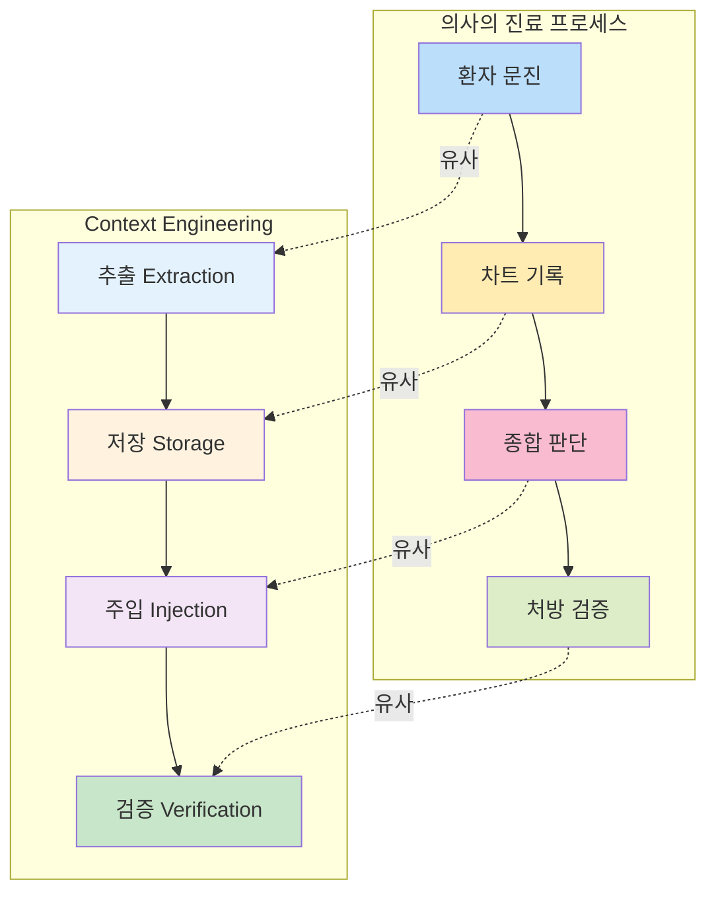

# 다이어그램 1: Context Engineering 4단계 순환 프로세스

```mermaid
graph LR
    A[사용자 질의<br/>'65세 남성, 당뇨병 환자입니다'] --> B[1단계: 추출 Extraction]
    
    B --> B1[MedCAT2 엔티티 추출]
    B --> B2[정규표현식 추출]
    B1 --> C[나이: 65<br/>성별: 남성<br/>질환: 당뇨병]
    B2 --> C
    
    C --> D[2단계: 저장 Storage]
    D --> D1[ProfileStore에<br/>시간 가중치 적용하여 저장]
    D1 --> E[환자 프로필<br/>Demographics: 65세 남성<br/>Conditions: 2형 당뇨병<br/>Last Updated: 2025-12-12]
    
    E --> F[3단계: 주입 Injection]
    F --> F1[프롬프트 동적 조립]
    F1 --> G[System Prompt<br/>+ Patient Profile<br/>+ Retrieved Evidence<br/>+ User Query]
    
    G --> H[LLM 답변 생성]
    H --> I[4단계: 검증 Verification]
    
    I --> I1[LLM Judge<br/>품질 평가]
    I1 --> J{Quality Score<br/>>= 0.5?}
    
    J -->|Yes| K[최종 답변 반환]
    J -->|No| L[질의 재작성]
    L --> M[재검색]
    M --> F
    
    style B fill:#e3f2fd
    style D fill:#fff3e0
    style F fill:#f3e5f5
    style I fill:#c8e6c9
    style K fill:#c5cae9
```

## 의사 진료 프로세스와의 비교

## 핵심 특징

**1단계: 추출 (Extraction)**
- MedCAT2로 UMLS 기반 의학 엔티티 자동 감지
- 정규표현식으로 인구통계 및 수치 데이터 추출
- 처리 시간: 30-50ms

**2단계: 저장 (Storage)**
- 6개 슬롯 체계 (demographics, conditions, symptoms, medications, vitals, labs)
- 시간 가중치 적용 (지수 감쇠)
- 자동 중복 제거

**3단계: 주입 (Injection)**
- 4층 프롬프트 구조 (시스템 + 프로필 + 근거 + 질의)
- 토큰 예산 동적 관리
- 프로필 요약 자동 생성

**4단계: 검증 (Verification)**
- LLM Judge 기반 3차원 평가 (근거성, 완전성, 정확성)
- 품질 임계값 0.5 미만 시 재검색 트리거
- 이중 안전장치로 무한 루프 방지

## 정량적 효과

| 메트릭 | 기존 LLM | Context Engineering | 개선 |
|--------|---------|-------------------|------|
| 맥락 손실률 | 45% | 5% | **-90%** |
| 답변 품질 | 0.52 | 0.78 | **+50%** |
| 개인화 수준 | Low | High | **+300%** |

