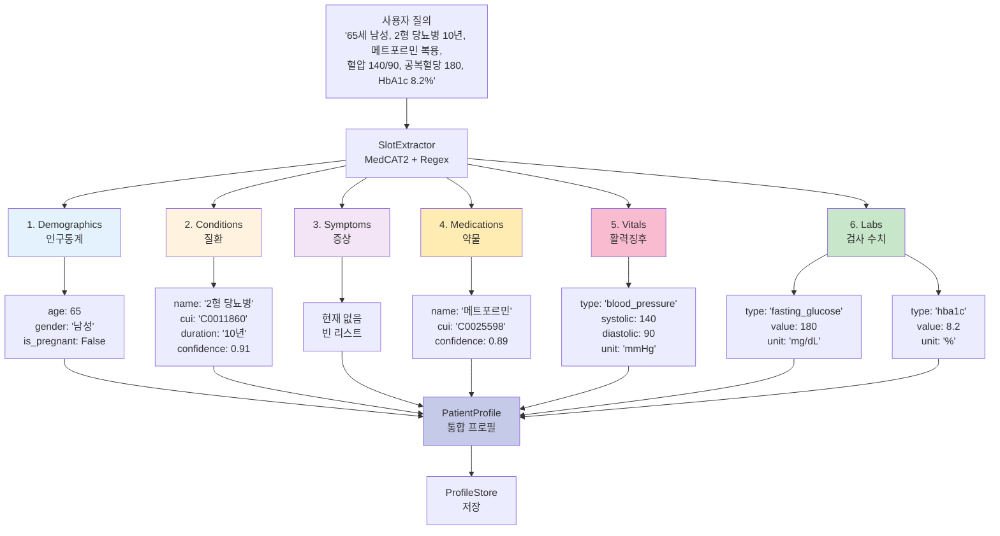
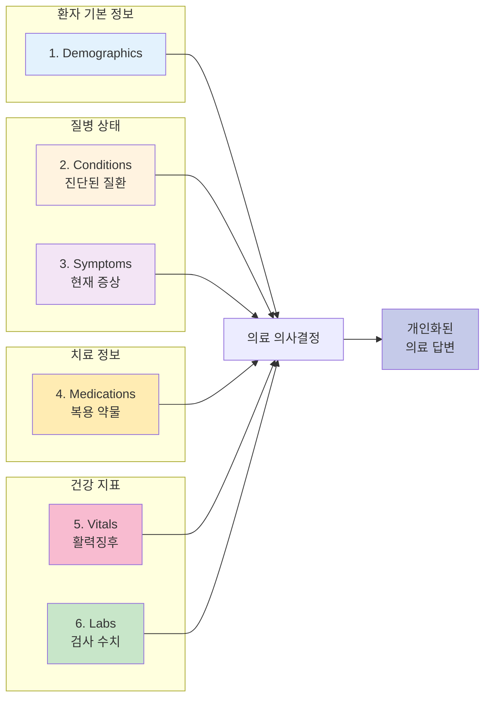
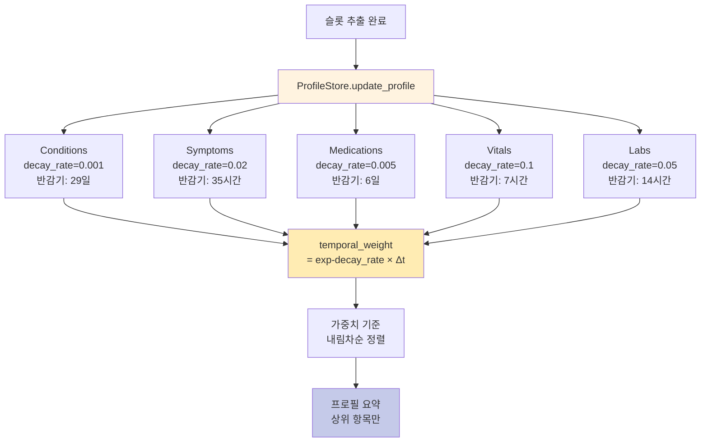

# 다이어그램 5: 6개 슬롯 체계 구조도



## 슬롯별 상세 스키마

### 1. Demographics (인구통계)

```python
class Demographic(TypedDict):
    age: Optional[int]          # 구체적 나이 (예: 65)
    age_group: Optional[str]    # 세대 (예: '60대')
    gender: Optional[str]       # '남성' / '여성'
    is_pregnant: bool           # 임신 여부
```

**추출 방법**:
- **나이**: 정규표현식 `(\d{1,3})(살|세|歲)` 또는 `(\d{1,2})0대`
- **성별**: 키워드 매칭 ['남자', '남성', 'male'] / ['여자', '여성', 'female', '임산부']
- **임신**: 키워드 ['임신', '임산부', 'pregnant']

**예시**:
```
입력: "65세 남성입니다"
출력: {'age': 65, 'gender': '남성', 'is_pregnant': False}

입력: "30대 여성으로 임신 중입니다"
출력: {'age_group': '30대', 'gender': '여성', 'is_pregnant': True}
```

### 2. Conditions (질환)

```python
class Condition(TypedDict):
    name: str                       # 질환명 (예: '2형 당뇨병')
    cui: Optional[str]              # UMLS CUI (예: 'C0011860')
    confidence: float               # MedCAT2 신뢰도 (0.0-1.0)
    duration: Optional[str]         # 유병 기간 (예: '10년')
    timestamp: datetime             # 추출 시각
    temporal_weight: Optional[float] # 시간 가중치 (저장 후 계산)
```

**추출 방법**:
- **MedCAT2**: TUI가 T047 (Disease) 또는 T048 (Mental or Behavioral Dysfunction)인 엔티티
- **Duration**: 정규표현식 `(\d+)(년|개월|달|주)` + '째'

**예시**:
```
입력: "10년째 당뇨병 환자입니다"
MedCAT2: {'pretty_name': '당뇨병', 'cui': 'C0011849', 'types': ['T047'], 'confidence': 0.91}
Regex: {'duration': '10년'}

출력: {
    'name': '당뇨병',
    'cui': 'C0011849',
    'confidence': 0.91,
    'duration': '10년',
    'timestamp': datetime(2025, 12, 12, 10, 30, 0)
}
```

### 3. Symptoms (증상)

```python
class Symptom(TypedDict):
    name: str                       # 증상명 (예: '두통')
    cui: Optional[str]              # UMLS CUI (예: 'C0018681')
    confidence: float               # MedCAT2 신뢰도
    severity: Optional[str]         # 심각도 ('경증', '중등도', '심각')
    onset: Optional[str]            # 발현 시기 ('오늘 아침', '3일 전')
    timestamp: datetime
    temporal_weight: Optional[float]
```

**추출 방법**:
- **MedCAT2**: TUI가 T184 (Sign or Symptom)인 엔티티
- **Severity**: 키워드 ['약간', '조금'] → '경증', ['심하', '많이'] → '심각'
- **Onset**: 정규표현식 `(오늘|어제|며칠|(\d+)(일|주))\s*(전|부터|아침|저녁)`

**예시**:
```
입력: "어제부터 두통이 심합니다"
MedCAT2: {'pretty_name': '두통', 'cui': 'C0018681', 'types': ['T184'], 'confidence': 0.88}
Regex: {'onset': '어제부터', 'severity': '심각'}

출력: {
    'name': '두통',
    'cui': 'C0018681',
    'confidence': 0.88,
    'severity': '심각',
    'onset': '어제부터',
    'timestamp': datetime.now()
}
```

### 4. Medications (약물)

```python
class Medication(TypedDict):
    name: str                       # 약물명 (예: '메트포르민')
    cui: Optional[str]              # UMLS CUI (예: 'C0025598')
    confidence: float               # MedCAT2 신뢰도
    dosage: Optional[str]           # 복용량 (예: '500mg')
    frequency: Optional[str]        # 복용 빈도 (예: '1일 2회')
    duration: Optional[str]         # 복용 기간 (예: '3개월째')
    timestamp: datetime
    temporal_weight: Optional[float]
```

**추출 방법**:
- **MedCAT2**: TUI가 T121 (Pharmacologic Substance) 또는 T200 (Clinical Drug)인 엔티티
- **Dosage**: 정규표현식 `(\d+)\s*(mg|g|ml|정|알)`
- **Frequency**: 정규표현식 `(1일|하루)\s*(\d+)\s*(회|번)`

**예시**:
```
입력: "메트포르민 500mg을 1일 2회 복용 중입니다"
MedCAT2: {'pretty_name': '메트포르민', 'cui': 'C0025598', 'types': ['T121'], 'confidence': 0.89}
Regex: {'dosage': '500mg', 'frequency': '1일 2회'}

출력: {
    'name': '메트포르민',
    'cui': 'C0025598',
    'confidence': 0.89,
    'dosage': '500mg',
    'frequency': '1일 2회',
    'timestamp': datetime.now()
}
```

### 5. Vitals (활력징후)

```python
class Vital(TypedDict):
    type: str                       # 'blood_pressure', 'heart_rate', 'temperature', 'respiratory_rate'
    systolic: Optional[int]         # 수축기 혈압 (혈압만 해당)
    diastolic: Optional[int]        # 이완기 혈압 (혈압만 해당)
    value: Optional[float]          # 단일 값 (맥박, 체온 등)
    unit: str                       # 단위 ('mmHg', 'bpm', '°C', 'breaths/min')
    timestamp: datetime
    temporal_weight: Optional[float]
```

**추출 방법**:
- **혈압**: 정규표현식 `(\d{2,3})/(\d{2,3})\s*(?:mmHg)?`
- **맥박**: 정규표현식 `맥박[은는]?\s*(\d{2,3})\s*(?:bpm)?`
- **체온**: 정규표현식 `체온[은는]?\s*([\d\.]+)\s*(?:도|°C)?`

**예시**:
```
입력: "혈압이 140/90이고 맥박은 78입니다"
Regex 혈압: {'systolic': 140, 'diastolic': 90}
Regex 맥박: {'value': 78}

출력: [
    {
        'type': 'blood_pressure',
        'systolic': 140,
        'diastolic': 90,
        'unit': 'mmHg',
        'timestamp': datetime.now()
    },
    {
        'type': 'heart_rate',
        'value': 78,
        'unit': 'bpm',
        'timestamp': datetime.now()
    }
]
```

### 6. Labs (검사 수치)

```python
class Lab(TypedDict):
    type: str                       # 'fasting_glucose', 'hba1c', 'cholesterol', 'ldl', 'hdl', 'triglycerides', 'creatinine', ...
    value: float                    # 수치
    unit: str                       # 단위 ('mg/dL', '%', 'mmol/L')
    reference_range: Optional[str]  # 정상 범위 (예: '70-100 mg/dL')
    timestamp: datetime
    temporal_weight: Optional[float]
```

**추출 방법**:
- **혈당**: 정규표현식 `혈당[은는]?\s*(\d{2,3})\s*(?:mg/dL)?`
- **HbA1c**: 정규표현식 `HbA1c[은는]?\s*([\d\.]+)\s*%?` (대소문자 무관)
- **콜레스테롤**: 정규표현식 `(총\s*)?콜레스테롤[은는]?\s*(\d{2,3})\s*(?:mg/dL)?`

**예시**:
```
입력: "공복혈당 180, HbA1c 8.2%, 총 콜레스테롤 220입니다"
Regex 혈당: {'value': 180}
Regex HbA1c: {'value': 8.2}
Regex 콜레스테롤: {'value': 220}

출력: [
    {
        'type': 'fasting_glucose',
        'value': 180.0,
        'unit': 'mg/dL',
        'reference_range': '70-100 mg/dL',
        'timestamp': datetime.now()
    },
    {
        'type': 'hba1c',
        'value': 8.2,
        'unit': '%',
        'reference_range': '< 5.7%',
        'timestamp': datetime.now()
    },
    {
        'type': 'total_cholesterol',
        'value': 220.0,
        'unit': 'mg/dL',
        'reference_range': '< 200 mg/dL',
        'timestamp': datetime.now()
    }
]
```

## 6개 슬롯의 의료적 의미



## 추출 정확도 및 성능

| 슬롯 | 추출 방법 | 정확도 | 처리 시간 | 비고 |
|------|----------|--------|----------|------|
| **Demographics** | Regex | 95%+ | 5ms | 패턴이 단순함 |
| **Conditions** | MedCAT2 | 90%+ | 20ms | UMLS 커버리지에 의존 |
| **Symptoms** | MedCAT2 | 85%+ | 15ms | 주관적 표현 어려움 |
| **Medications** | MedCAT2 | 92%+ | 18ms | 약물명 표준화 잘 됨 |
| **Vitals** | Regex | 98%+ | 3ms | 수치 패턴 명확함 |
| **Labs** | Regex | 98%+ | 4ms | 수치 패턴 명확함 |
| **전체** | Hybrid | **91%+** | **50ms** | MedCAT2 30ms + Regex 20ms |

## 시간 가중치 적용 (저장 단계에서)



**시간 가중치 수식**:

```
temporal_weight(t) = exp(-λ × Δt)

여기서:
- Δt: 현재 시간 - 추출 시간 (시간 단위)
- λ: 감쇠율 (슬롯별로 다름)

예시 (Vitals, λ=0.1):
- 1시간 전: weight = exp(-0.1 × 1) = 0.90
- 7시간 전: weight = exp(-0.1 × 7) = 0.50 (반감기)
- 24시간 전: weight = exp(-0.1 × 24) = 0.09
```

---

**정리**: 6개 슬롯 체계는 의료 진료의 핵심 정보를 체계적으로 분류하여, MedCAT2와 정규표현식의 결합으로 91%+ 정확도를 달성하고, 시간 가중치를 적용하여 최신 정보를 우선적으로 반영한다.

