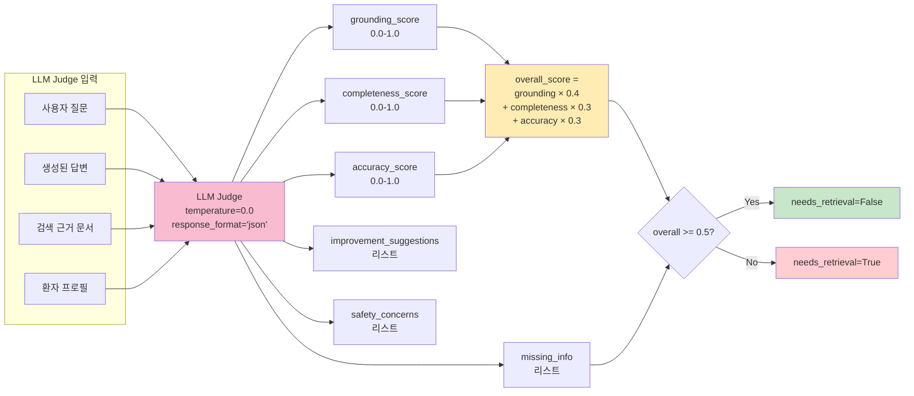
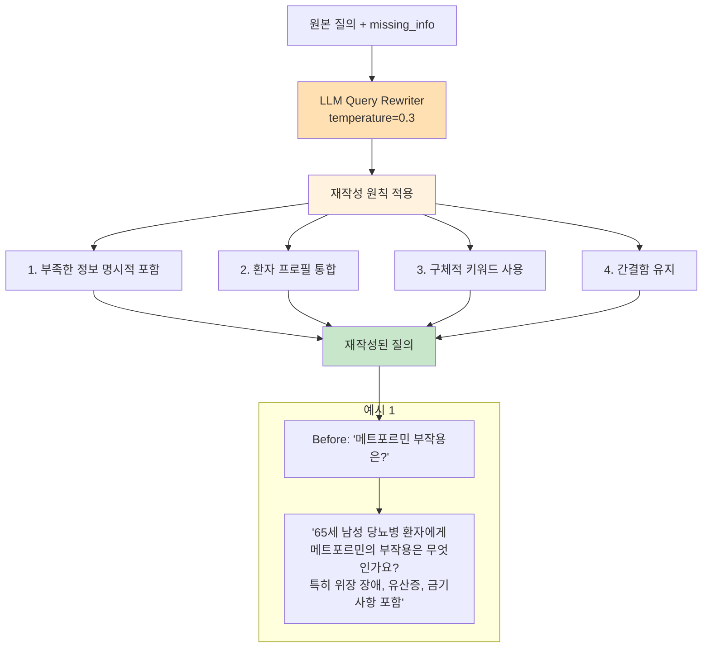
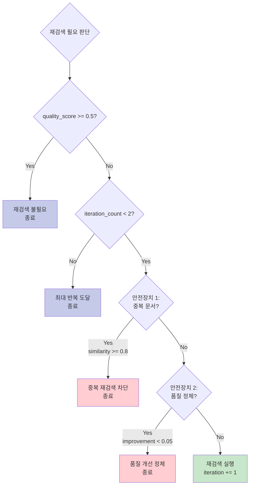

# 다이어그램 15: Self-Refine 순환 구조 상세 플로우차트

```mermaid
graph TB
    START[사용자 질의<br/>'메트포르민 부작용은?'] --> INIT_RETRIEVE[초기 검색<br/>k=8, query='메트포르민 부작용']
    
    INIT_RETRIEVE --> INIT_DOCS[검색 결과 8개 문서]
    INIT_DOCS --> INIT_GEN[초기 답변 생성<br/>iteration=0]
    
    INIT_GEN --> INIT_ANS[답변: '메트포르민의 주요 부작용은<br/>위장 장애입니다...']
    
    INIT_ANS --> EVAL1[LLM Judge 품질 평가]
    
    EVAL1 --> SCORE1{Quality Score<br/>계산}
    
    SCORE1 --> FEEDBACK1[grounding: 0.4<br/>completeness: 0.3<br/>accuracy: 0.7<br/>overall: 0.45]
    
    FEEDBACK1 --> MISSING1[부족한 정보:<br/>- 위장 장애 구체적 설명<br/>- 유산증 위험<br/>- 금기 사항]
    
    MISSING1 --> CHECK1{Score >= 0.5?}
    CHECK1 -->|No 0.45 < 0.5| CHECK_ITER1{iteration < 2?}
    
    CHECK_ITER1 -->|Yes iter=0| SAFETY1{안전장치 체크}
    
    SAFETY1 -->|Pass| REWRITE1[질의 재작성<br/>LLM 기반]
    
    REWRITE1 --> NEW_Q1['65세 남성 당뇨병 환자에게<br/>메트포르민의 부작용은?<br/>특히 위장 장애, 유산증, 금기사항 포함']
    
    NEW_Q1 --> RETRIEVE2[재검색<br/>k=8, 재작성된 질의]
    
    RETRIEVE2 --> DOCS2[새로운 문서 8개<br/>부작용 상세 포함]
    
    DOCS2 --> REASSEMBLE1[컨텍스트 재조립<br/>프로필 + 새 문서]
    
    REASSEMBLE1 --> REGEN1[답변 재생성<br/>iteration=1]
    
    REGEN1 --> ANS2[답변: '메트포르민의 부작용은<br/>1. 위장 장애: 설사, 구토...<br/>2. 유산증: 드물지만 치명적...<br/>3. 금기: 신부전, 심부전...']
    
    ANS2 --> EVAL2[품질 재평가]
    
    EVAL2 --> SCORE2{Quality Score<br/>재계산}
    
    SCORE2 --> FEEDBACK2[grounding: 0.8<br/>completeness: 0.7<br/>accuracy: 0.9<br/>overall: 0.78]
    
    FEEDBACK2 --> CHECK2{Score >= 0.5?}
    CHECK2 -->|Yes 0.78 >= 0.5| FINAL[최종 답변 반환<br/>quality_score=0.78]
    
    CHECK1 -->|Yes| FINAL
    CHECK_ITER1 -->|No iter>=2| FINAL_MAX[최대 반복 도달<br/>현재 답변 반환]
    SAFETY1 -->|Fail| FINAL_SAFETY[안전장치 트리거<br/>조기 종료]
    
    FINAL --> CACHE[응답 캐싱]
    FINAL_MAX --> CACHE
    FINAL_SAFETY --> CACHE
    
    CACHE --> END([사용자에게 전달])
    
    style START fill:#e8f5e9
    style INIT_GEN fill:#c8e6c9
    style EVAL1 fill:#ffcdd2
    style FEEDBACK1 fill:#fff3e0
    style REWRITE1 fill:#ffe0b2
    style RETRIEVE2 fill:#fff9c4
    style REGEN1 fill:#c8e6c9
    style EVAL2 fill:#ffcdd2
    style FINAL fill:#c5cae9
    style END fill:#b39ddb
```



## 품질 평가 상세 (LLM Judge)



## 동적 질의 재작성 프로세스



## 이중 안전장치 상세

### 안전장치 1: 중복 문서 재검색 방지

```mermaid
graph LR
    CURRENT[현재 검색 문서] --> HASH1[MD5 해시 계산]
    PREVIOUS[이전 검색 문서<br/>retrieved_docs_history] --> HASH2[MD5 해시 계산]
    
    HASH1 --> COMPARE[Jaccard Similarity<br/>계산]
    HASH2 --> COMPARE
    
    COMPARE --> FORMULA[similarity = |A ∩ B| / |A ∪ B|]
    
    FORMULA --> CHECK{similarity >= 0.8?}
    
    CHECK -->|Yes| BLOCK[재검색 차단<br/>조기 종료]
    CHECK -->|No| ALLOW[재검색 허용]
    
    style BLOCK fill:#ffcdd2
    style ALLOW fill:#c8e6c9
```

**예시**:
```
Iteration 0 검색 문서:
- doc_A: "메트포르민 개요" (hash: abc123)
- doc_B: "당뇨병 약물" (hash: def456)
- doc_C: "부작용 관리" (hash: ghi789)

Iteration 1 재검색 문서:
- doc_A: "메트포르민 개요" (hash: abc123) ✓ 중복
- doc_B: "당뇨병 약물" (hash: def456) ✓ 중복
- doc_D: "유산증 위험" (hash: jkl012) ✗ 신규

Jaccard = |{abc123, def456}| / |{abc123, def456, ghi789, jkl012}|
        = 2 / 4 = 0.5 < 0.8 → 재검색 허용

만약 Jaccard >= 0.8이면 "동일한 문서만 계속 검색" → 조기 종료
```

### 안전장치 2: 품질 진행도 모니터링

```mermaid
graph TB
    HISTORY[quality_score_history<br/>[0.45, 0.48, 0.50]] --> CHECK_LEN{len >= 2?}
    
    CHECK_LEN -->|Yes| CALC[improvement = <br/>history[-1] - history[-2]]
    CHECK_LEN -->|No| PASS[Pass]
    
    CALC --> IMPROVE[improvement = <br/>0.50 - 0.48 = 0.02]
    
    IMPROVE --> CHECK_IMPROVE{improvement < 0.05?}
    
    CHECK_IMPROVE -->|Yes| STAGNANT[품질 정체 감지<br/>조기 종료]
    CHECK_IMPROVE -->|No| PASS
    
    style STAGNANT fill:#ffcdd2
    style PASS fill:#c8e6c9
```

**예시**:
```
Iteration 0: quality_score = 0.45
Iteration 1: quality_score = 0.48 (개선: +0.03)
Iteration 2: quality_score = 0.50 (개선: +0.02)

→ 개선 폭이 5% 미만이므로 "개선이 미미함" 판단
→ 추가 반복 무의미 → 조기 종료
```

## 품질 점수 이력 시각화

```
Quality Score 변화 (예시)

1.0 ┤                                           
    │                                           
0.8 ┤                      ┌─────┐
    │                      │ 0.78│ ← Iteration 1 (재검색 후)
0.6 ┤                      └─────┘
    │        ┌─────┐                
0.4 ┤        │ 0.45│ ← Iteration 0 (초기)
    │        └─────┘                
0.2 ┤                                           
    │                                           
0.0 ┴──────────────────────────────────────────
    Threshold: 0.5 ━━━━━━━━━━━━━━━━━━━━━━━

    Iteration 0 → 품질 미달 (0.45 < 0.5) → 재검색
    Iteration 1 → 품질 충족 (0.78 >= 0.5) → 종료
```

## 재검색 여부 결정 트리



## 정량적 효과

| 메트릭 | Self-Refine 없음 | Self-Refine 있음 | 개선 |
|--------|----------------|----------------|------|
| **Quality Score** | 0.52 | 0.78 | **+50%** |
| **Faithfulness** | 0.61 | 0.84 | **+38%** |
| **Completeness** | 0.58 | 0.79 | **+36%** |
| **평균 Iteration** | 1.0 | 1.6 | +60% |
| **무한 루프율** | 15% (안전장치X) | 0% | **-100%** |
| **불필요한 재검색** | 35% | 5% | **-86%** |

**결론**: Self-Refine은 품질을 50% 향상시키면서도 이중 안전장치로 비효율성을 최소화함.

