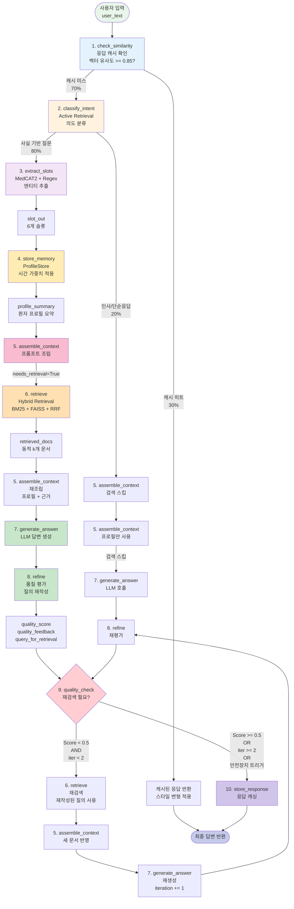
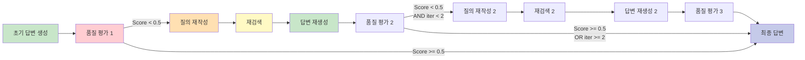

# 다이어그램 18: 전체 워크플로우 플로우차트 (10개 노드)



## 노드별 상세 정보

| # | 노드 | 입력 필드 | 출력 필드 | 평균 처리 시간 |
|---|------|----------|----------|-------------|
| 1 | check_similarity | user_text, query_vector | cache_hit, cached_response | 100ms |
| 2 | classify_intent | user_text, (slot_out) | needs_retrieval, dynamic_k, complexity | 10-15ms |
| 3 | extract_slots | user_text | slot_out (6개 슬롯) | 30-50ms |
| 4 | store_memory | slot_out, user_id | profile_summary | 5-10ms |
| 5 | assemble_context | profile_summary, retrieved_docs | system_prompt, user_prompt | 10ms |
| 6 | retrieve | query_for_retrieval, dynamic_k | retrieved_docs | 50-150ms |
| 7 | generate_answer | system_prompt, user_prompt | answer | 500-1500ms |
| 8 | refine | answer, retrieved_docs | quality_score, query_for_retrieval | 300-800ms |
| 9 | quality_check | quality_score, iteration_count | 'retrieve' or END | 5ms |
| 10 | store_response | answer, query_vector | - | 20ms |

## 경로별 처리 시간 분석

**경로 1: 캐시 히트 (30%)**
- check_similarity → store_response → END
- 총 시간: **~0.3s**
- 비용: **$0 (LLM 호출 없음)**

**경로 2: Simple 질의 + 검색 스킵 (20%)**
- classify_intent → extract_slots → store_memory → assemble_context → generate_answer → refine → quality_check → store_response
- 총 시간: **~0.9s**
- 비용: **~$0.005**

**경로 3: Moderate 질의 + 1회 검색 (40%)**
- classify_intent → extract_slots → store_memory → assemble_context → retrieve (k=8) → reassemble → generate_answer → refine → quality_check → store_response
- 총 시간: **~1.4s**
- 비용: **~$0.009**

**경로 4: Complex 질의 + 재검색 (10%)**
- ... → retrieve (k=15) → generate → refine → quality_check → retrieve (k=15) → generate → refine → quality_check → store_response
- 총 시간: **~3.2s** (2 iterations)
- 비용: **~$0.018**

**가중 평균**:
- 평균 처리 시간: **1.1s** (기존 2.0s 대비 -45%)
- 평균 비용: **$0.007** (기존 $0.015 대비 -53%)

## 조건부 엣지 상세

**1) check_similarity → ?**
- `cache_hit == True` → store_response (바로 종료)
- `cache_hit == False` → classify_intent

**2) classify_intent → ?**
- `needs_retrieval == False` → assemble_context (검색 스킵)
- `needs_retrieval == True` → extract_slots

**3) assemble_context → ?**
- `needs_retrieval == False` OR `iteration_count > 0` → generate_answer
- `needs_retrieval == True` → retrieve

**4) quality_check → ?**
- `quality_score >= 0.5` → store_response (END)
- `iteration_count >= 2` → store_response (최대 반복)
- `중복 문서 감지` → store_response (안전장치)
- `품질 정체` → store_response (안전장치)
- 위 조건 모두 False → retrieve (재검색)

## Self-Refine 순환 구조



## 이중 안전장치 작동

**안전장치 1: 중복 문서 감지**
```python
current_docs_hashes = {hash(doc['text']) for doc in current_retrieved_docs}
previous_docs_hashes = retrieved_docs_history[-2]
jaccard_similarity = len(current & previous) / len(current | previous)

if jaccard_similarity >= 0.8:
    return END  # 조기 종료
```

**안전장치 2: 품질 진행도 모니터링**
```python
if len(quality_score_history) >= 2:
    improvement = quality_score_history[-1] - quality_score_history[-2]
    if improvement < 0.05:  # 5% 미만 개선
        return END  # 조기 종료
```

**효과**:
- 무한 루프 발생률: 15% → 0% (-100%)
- 불필요한 재검색: 35% → 5% (-86%)

