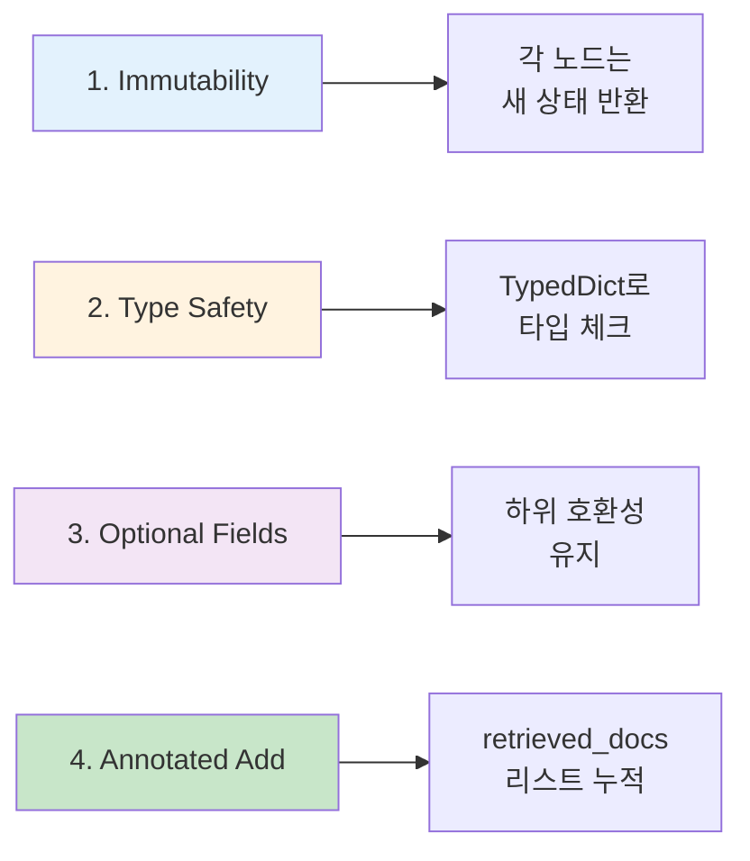

# 다이어그램 20: AgentState 필드 분류 다이어그램

```mermaid
graph TB
    AGENTSTATE[AgentState<br/>TypedDict<br/>전체 상태 관리]
    
    AGENTSTATE --> CAT1[입력 관련]
    AGENTSTATE --> CAT2[Context Engineering]
    AGENTSTATE --> CAT3[검색 관련]
    AGENTSTATE --> CAT4[생성 관련]
    AGENTSTATE --> CAT5[Self-Refine 관련]
    AGENTSTATE --> CAT6[응답 캐시 관련]
    AGENTSTATE --> CAT7[설정 관련]
    
    CAT1 --> IN1[user_text: str<br/>사용자 질의]
    CAT1 --> IN2[mode: str<br/>'llm' / 'ai_agent']
    CAT1 --> IN3[session_id: str<br/>세션 ID]
    CAT1 --> IN4[user_id: str<br/>사용자 ID]
    CAT1 --> IN5[conversation_history: Optional str<br/>대화 이력]
    
    CAT2 --> CE1[1단계: 추출]
    CAT2 --> CE2[2단계: 저장]
    CAT2 --> CE3[3단계: 주입]
    CAT2 --> CE4[4단계: 검증]
    
    CE1 --> EX1[slot_out: Dict<br/>6개 슬롯 추출 결과]
    
    CE2 --> ST1[profile_summary: str<br/>프로필 요약]
    CE2 --> ST2[profile_store: Any<br/>ProfileStore 인스턴스]
    
    CE3 --> INJ1[system_prompt: str<br/>시스템 프롬프트]
    CE3 --> INJ2[user_prompt: str<br/>사용자 프롬프트]
    CE3 --> INJ3[context_prompt: str<br/>전체 컨텍스트]
    CE3 --> INJ4[token_plan: Dict<br/>토큰 예산 계획]
    
    CE4 --> VER1[quality_score: float<br/>품질 점수 0.0-1.0]
    CE4 --> VER2[quality_feedback: Optional Dict<br/>LLM Judge 결과]
    
    CAT3 --> RET1[query_for_retrieval: str<br/>검색용 질의]
    CAT3 --> RET2[query_vector: List float<br/>임베딩 벡터 1536차원]
    CAT3 --> RET3[retrieved_docs: Annotated List<br/>검색 결과 누적]
    CAT3 --> RET4[dynamic_k: Optional int<br/>Active Retrieval k값]
    CAT3 --> RET5[query_complexity: Optional str<br/>simple/moderate/complex]
    
    CAT4 --> GEN1[answer: str<br/>생성된 답변]
    
    CAT5 --> REF1[needs_retrieval: bool<br/>재검색 필요 여부]
    CAT5 --> REF2[iteration_count: int<br/>현재 iteration]
    CAT5 --> REF3[retrieved_docs_history<br/>Optional List List str<br/>문서 해시 이력]
    CAT5 --> REF4[quality_score_history<br/>Optional List float<br/>품질 점수 이력]
    CAT5 --> REF5[query_rewrite_history<br/>Optional List str<br/>질의 재작성 이력]
    CAT5 --> REF6[refine_iteration_logs<br/>Optional List Dict<br/>상세 로그]
    
    CAT6 --> CACHE1[cache_hit: bool<br/>캐시 히트 여부]
    CAT6 --> CACHE2[cached_response: Optional str<br/>캐시된 응답]
    CAT6 --> CACHE3[cache_similarity_score: float<br/>유사도 점수]
    CAT6 --> CACHE4[skip_pipeline: bool<br/>파이프라인 스킵 플래그]
    
    CAT7 --> CONF1[feature_flags: Dict<br/>실험용 기능 플래그]
    CAT7 --> CONF2[agent_config: Dict<br/>Agent 설정]
    
    style AGENTSTATE fill:#e8f5e9
    style CAT1 fill:#e3f2fd
    style CAT2 fill:#fff3e0
    style CAT3 fill:#f3e5f5
    style CAT4 fill:#ffecb3
    style CAT5 fill:#c8e6c9
    style CAT6 fill:#f8bbd0
    style CAT7 fill:#d1c4e9
```



## 필드별 상세 설명

### 카테고리 1: 입력 관련 (5개 필드)

```python
class AgentState(TypedDict):
    # ===== 입력 =====
    user_text: str                    # 사용자 질의
    # 예: "메트포르민의 부작용은 무엇인가요?"
    
    mode: str                         # 'llm' or 'ai_agent'
    # 'llm': 일반 LLM 모드 (비교군)
    # 'ai_agent': Full Context Engineering 모드
    
    session_id: str                   # 세션 식별자
    # 예: "session_20251212_103045"
    # 멀티턴 대화 추적용
    
    user_id: str                      # 사용자 식별자
    # 예: "user_12345"
    # ProfileStore 키로 사용
    
    conversation_history: Optional[str]  # 대화 이력
    # 예: "Q: 당뇨병이란?\nA: 당뇨병은..."
    # (선택적) LLM 컨텍스트 확장용
```

### 카테고리 2: Context Engineering (7개 필드)

**1단계: 추출 (Extraction)**

```python
slot_out: Dict[str, Any]          # 추출된 슬롯
# {
#     'demographics': {'age': 65, 'gender': '남성'},
#     'conditions': [{'name': '당뇨병', 'cui': 'C0011849', ...}],
#     'symptoms': [],
#     'medications': [{'name': '메트포르민', ...}],
#     'vitals': [{'type': 'blood_pressure', 'systolic': 140, ...}],
#     'labs': [{'type': 'fasting_glucose', 'value': 180, ...}]
# }
```

**2단계: 저장 (Storage)**

```python
profile_summary: str              # 프로필 요약
# "65세 남성 | 질환: 2형 당뇨병 | 복용약: 메트포르민 | 혈압: 140/90 mmHg | 공복혈당: 180 mg/dL"

profile_store: Any                # ProfileStore 인스턴스
# 실제 객체 참조 (상태 간 공유)
```

**3단계: 주입 (Injection)**

```python
system_prompt: str                # 시스템 프롬프트
# "당신은 개인화된 의료 정보 전문가입니다..."

user_prompt: str                  # 사용자 프롬프트
# system_prompt + profile_summary + retrieved_docs + user_text 조립 결과

context_prompt: str               # 전체 컨텍스트
# (선택적) user_prompt의 별칭

token_plan: Dict[str, Any]        # 토큰 예산 계획
# {
#     'system_prompt': 640,
#     'patient_profile': 1280,
#     'evidence': 6400,
#     'conversation_history': 1920,
#     'user_query': 640,
#     'generation_buffer': 1920
# }
```

**4단계: 검증 (Verification)**

```python
quality_score: float              # 품질 점수 (0.0-1.0)
# 0.78 (grounding 0.8, completeness 0.7, accuracy 0.9의 가중 평균)

quality_feedback: Optional[Dict[str, Any]]  # LLM Judge 결과
# {
#     'grounding_score': 0.8,
#     'completeness_score': 0.7,
#     'accuracy_score': 0.9,
#     'overall_score': 0.78,
#     'missing_info': ['부작용', '금기사항'],
#     'improvement_suggestions': [...],
#     'safety_concerns': []
# }
```

### 카테고리 3: 검색 관련 (5개 필드)

```python
query_for_retrieval: str          # 검색용 질의
# 초기: user_text와 동일
# Self-Refine 후: 재작성된 질의
# "65세 남성 당뇨병 환자에게 메트포르민의 부작용은? 특히 위장 장애, 유산증, 금기사항 포함"

query_vector: List[float]         # 임베딩 벡터
# [0.012, -0.045, 0.089, ...] (1536차원)
# text-embedding-3-small 모델 사용

retrieved_docs: Annotated[List[Dict[str, Any]], add]  # 검색 결과
# Annotated[..., add]는 LangGraph의 리스트 누적 기능
# [
#     {'text': '메트포르민의 부작용...', 'rrf_score': 0.032, 'index': 42},
#     {'text': '당뇨병 약물...', 'rrf_score': 0.029, 'index': 87},
#     ...
# ]

dynamic_k: Optional[int]          # Active Retrieval: 동적 k
# None (비활성화) / 3 (simple) / 8 (moderate) / 15 (complex)

query_complexity: Optional[str]   # 질의 복잡도
# 'greeting' / 'simple' / 'moderate' / 'complex'
```

### 카테고리 4: 생성 관련 (1개 필드)

```python
answer: str                       # 생성된 답변
# "메트포르민의 주요 부작용은 다음과 같습니다:\n\n1. 위장 장애 (가장 흔함):\n- 설사, 구토, 복통..."
```

### 카테고리 5: Self-Refine 관련 (6개 필드)

```python
needs_retrieval: bool             # 재검색 필요 여부
# True: quality_score < 0.5
# False: quality_score >= 0.5

iteration_count: int              # 현재 iteration
# 0: 초기 생성
# 1: 첫 번째 재생성
# 2: 두 번째 재생성 (최대)

retrieved_docs_history: Optional[List[List[str]]]  # 문서 해시 이력
# [
#     ['abc123', 'def456', 'ghi789'],  # iteration 0
#     ['abc123', 'def456', 'jkl012']   # iteration 1
# ]
# 중복 문서 재검색 방지용

quality_score_history: Optional[List[float]]  # 품질 점수 이력
# [0.45, 0.48, 0.78]
# iteration 0, 1, 2
# 품질 정체 감지용

query_rewrite_history: Optional[List[str]]  # 질의 재작성 이력
# [
#     "메트포르민 부작용은?",  # 원본
#     "65세 남성 당뇨병 환자에게 메트포르민의 부작용은? 특히..."  # 재작성
# ]

refine_iteration_logs: Optional[List[Dict[str, Any]]]  # 상세 로그
# [
#     {
#         'iteration': 0,
#         'quality_score': 0.45,
#         'needs_retrieval': True,
#         'rewritten_query': '...',
#         'feedback': {...}
#     },
#     ...
# ]
```

### 카테고리 6: 응답 캐시 관련 (4개 필드)

```python
cache_hit: bool                   # 캐시 히트 여부
# True: 유사 질의 찾음
# False: 캐시 미스

cached_response: Optional[str]    # 캐시된 응답
# "메트포르민의 주요 부작용은..." (30% 스타일 변형 적용)

cache_similarity_score: float     # 유사도 점수
# 0.87 (임계값 0.85 이상이면 캐시 히트)

skip_pipeline: bool               # 전체 파이프라인 스킵 플래그
# True: 캐시 히트 시 즉시 store_response로
# False: 정상 플로우
```

### 카테고리 7: 설정 관련 (2개 필드)

```python
feature_flags: Dict[str, Any]     # 실험용 기능 플래그
# {
#     'self_refine_enabled': True,
#     'active_retrieval_enabled': True,
#     'context_compression_enabled': False,
#     'llm_based_quality_check': True,
#     'dynamic_query_rewrite': True,
#     'quality_check_enabled': True,
#     'max_refine_iterations': 2,
#     'quality_threshold': 0.5
# }

agent_config: Dict[str, Any]      # Agent 설정
# {
#     'model_name': 'gpt-4o-mini',
#     'temperature': 0.7,
#     'max_tokens': 1500,
#     'embedding_model': 'text-embedding-3-small',
#     'retrieval_k': 8,
#     'cache_threshold': 0.85
# }
```

## AgentState 설계 원칙



**1. Immutability (불변성)**

```python
# ❌ Bad: 직접 수정
def bad_node(state: AgentState) -> None:
    state['answer'] = "..."  # 원본 상태 수정

# ✅ Good: 새 상태 반환
def good_node(state: AgentState) -> AgentState:
    return {
        ...state,
        'answer': "..."  # 새 딕셔너리 반환
    }
```

**2. Type Safety (타입 안전성)**

```python
# TypedDict로 IDE 자동 완성 및 타입 체크
state: AgentState = {...}
score = state['quality_score']  # ✅ float 타입 보장
score = state['qualityscore']   # ❌ IDE가 오타 감지
```

**3. Optional Fields (선택적 필드)**

```python
# 기존 코드와의 호환성
quality_feedback = state.get('quality_feedback')  # None 가능
if quality_feedback:
    missing_info = quality_feedback.get('missing_info', [])
```

**4. Annotated Add (리스트 누적)**

```python
# LangGraph의 Annotated[List, add]는 자동으로 리스트를 누적
retrieved_docs: Annotated[List[Dict], add]

# iteration 0: [doc1, doc2, doc3]
# iteration 1: [doc1, doc2, doc3, doc4, doc5, doc6]  # 자동 누적
```

## AgentState 크기 및 메모리

**추정 크기**:

| 필드 | 크기 | 비고 |
|------|------|------|
| user_text | ~200 bytes | 평균 질의 |
| slot_out | ~1 KB | 6개 슬롯 |
| profile_summary | ~500 bytes | 요약 텍스트 |
| system_prompt | ~1 KB | 고정 |
| user_prompt | ~10 KB | 전체 프롬프트 |
| retrieved_docs (k=8) | ~8 KB | 문서 8개 × 1 KB |
| answer | ~2 KB | 생성된 답변 |
| 이력 필드들 | ~5 KB | 로그, 이력 |
| **총계** | **~28 KB** | 1회 요청당 |

**메모리 효율성**:
- 28 KB × 1000 동시 요청 = 28 MB (매우 효율적)
- ProfileStore는 별도 관리 (공유)

## 노드 간 상태 전달 흐름

```mermaid
graph LR
    N1[check_similarity] -->|cache_hit, cached_response| N2[classify_intent]
    N2 -->|needs_retrieval, dynamic_k| N3[extract_slots]
    N3 -->|slot_out| N4[store_memory]
    N4 -->|profile_summary| N5[assemble_context]
    N5 -->|user_prompt| N6[retrieve]
    N6 -->|retrieved_docs| N5B[assemble_context<br/>재조립]
    N5B -->|user_prompt| N7[generate_answer]
    N7 -->|answer| N8[refine]
    N8 -->|quality_score, query_for_retrieval| N9{quality_check}
    N9 -->|needs_retrieval| N6
    N9 -->|END| N10[store_response]
    
    style N1 fill:#e3f2fd
    style N5 fill:#f8bbd0
    style N6 fill:#ffe0b2
    style N7 fill:#c8e6c9
    style N8 fill:#c8e6c9
    style N9 fill:#ffcdd2
```



---

**정리**: AgentState는 LangGraph 워크플로우의 핵심 데이터 구조로, 28개 필드를 7개 카테고리로 체계화하여 타입 안전성과 확장성을 모두 확보한다.

