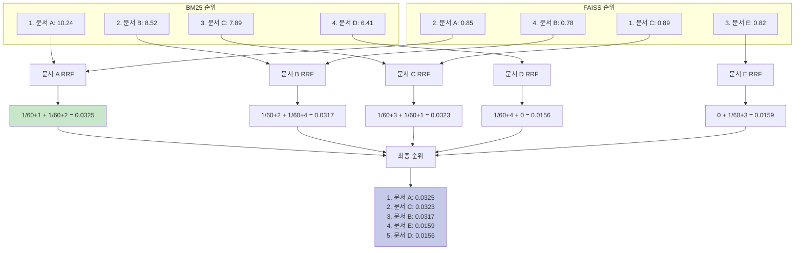
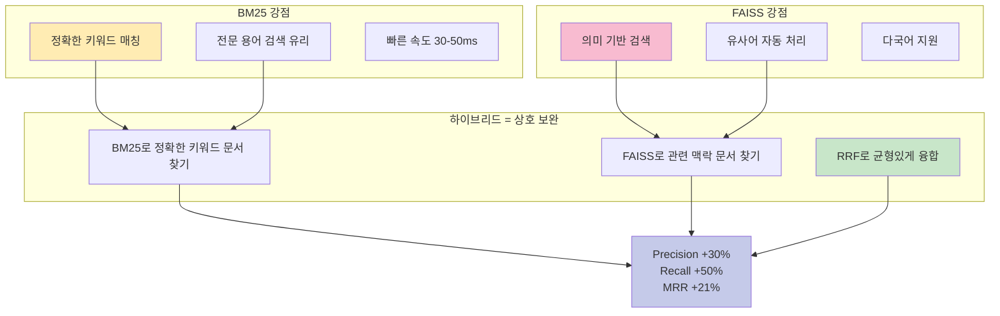

# 다이어그램 24: 하이브리드 검색 (BM25 + FAISS + RRF) 구조도

```mermaid
graph TB
    QUERY[사용자 질의<br/>'메트포르민 부작용'] --> SPLIT{검색 방법 분기}
    
    subgraph "BM25 키워드 검색"
        SPLIT --> BM25_1[형태소 분석<br/>MeCab]
        BM25_1 --> BM25_2[토큰화<br/>['메트포르민', '부작용']]
        BM25_2 --> BM25_3[BM25 점수 계산]
        BM25_3 --> BM25_4[상위 k×2=16개 선택]
        BM25_4 --> BM25_RESULT[BM25 결과<br/>순위 1-16]
    end
    
    subgraph "FAISS 벡터 검색"
        SPLIT --> FAISS_1[임베딩 생성<br/>text-embedding-3-small]
        FAISS_1 --> FAISS_2[벡터 1536차원]
        FAISS_2 --> FAISS_3[FAISS IndexFlatIP<br/>코사인 유사도]
        FAISS_3 --> FAISS_4[상위 k×2=16개 선택]
        FAISS_4 --> FAISS_RESULT[FAISS 결과<br/>순위 1-16]
    end
    
    BM25_RESULT --> RRF[Reciprocal Rank Fusion<br/>RRF]
    FAISS_RESULT --> RRF
    
    RRF --> RRF_CALC[RRF 점수 계산<br/>각 문서별로]
    
    RRF_CALC --> RRF_FORMULA[RRF d = Σ 1/60+rank<br/>BM25 + FAISS]
    
    RRF_FORMULA --> RRF_SORT[RRF 점수 기준<br/>내림차순 정렬]
    
    RRF_SORT --> FINAL[최종 상위 k=8개<br/>문서 반환]
    
    style BM25_3 fill:#ffecb3
    style FAISS_3 fill:#f8bbd0
    style RRF fill:#c8e6c9
    style FINAL fill:#c5cae9
```

## BM25 상세 수식

```
BM25(D, Q) = Σ IDF(qi) × (f(qi,D) × (k1+1)) / (f(qi,D) + k1 × (1-b + b×|D|/avgdl))

여기서:
- D: 문서
- Q: 질의
- qi: 질의 내 i번째 단어
- f(qi, D): 문서 D 내 qi의 빈도
- |D|: 문서 D의 길이 (단어 수)
- avgdl: 평균 문서 길이
- k1: 1.5 (항 빈도 포화 파라미터)
- b: 0.75 (문서 길이 정규화 파라미터)

IDF(qi) = log((N - n(qi) + 0.5) / (n(qi) + 0.5))
- N: 전체 문서 수
- n(qi): qi를 포함하는 문서 수
```

**예시 계산**:

```
질의: "메트포르민 부작용"
문서 A: "메트포르민의 부작용은 위장 장애, 설사, 구토입니다. 메트포르민 복용 시 주의해야 합니다."

토큰화:
- 질의: ['메트포르민', '부작용']
- 문서 A: ['메트포르민', '부작용', '위장', '장애', '설사', '구토', '메트포르민', '복용', '주의']

빈도:
- f('메트포르민', A) = 2
- f('부작용', A) = 1
- |A| = 9 단어
- avgdl = 15 (가정)

가정: N=5000, n('메트포르민')=100, n('부작용')=200

IDF('메트포르민') = log((5000-100+0.5)/(100+0.5)) = log(48.8) = 3.89
IDF('부작용') = log((5000-200+0.5)/(200+0.5)) = log(23.9) = 3.17

BM25 스코어 ('메트포르민'):
= 3.89 × (2 × 2.5) / (2 + 1.5 × (1 - 0.75 + 0.75 × 9/15))
= 3.89 × 5 / (2 + 1.5 × 0.7)
= 3.89 × 5 / 3.05
= 6.38

BM25 스코어 ('부작용'):
= 3.17 × (1 × 2.5) / (1 + 1.5 × 0.7)
= 3.17 × 2.5 / 2.05
= 3.86

총 BM25(A, Q) = 6.38 + 3.86 = 10.24
```

## FAISS 코사인 유사도 계산

```mermaid
graph LR
    Q[질의 텍스트] --> EMB_Q[임베딩<br/>OpenAI API]
    D[문서 텍스트] --> EMB_D[임베딩<br/>OpenAI API]
    
    EMB_Q --> VEC_Q[벡터 q<br/>1536차원]
    EMB_D --> VEC_D[벡터 d<br/>1536차원]
    
    VEC_Q --> NORM_Q[L2 정규화<br/>q' = q / ||q||]
    VEC_D --> NORM_D[L2 정규화<br/>d' = d / ||d||]
    
    NORM_Q --> DOT[내적 Inner Product<br/>q' · d']
    NORM_D --> DOT
    
    DOT --> SIM[코사인 유사도<br/>0.0 ~ 1.0]
    
    style EMB_Q fill:#f8bbd0
    style EMB_D fill:#f8bbd0
    style DOT fill:#c8e6c9
    style SIM fill:#c5cae9
```

**수식**:

```
cosine_similarity(q, d) = (q · d) / (||q|| × ||d||)

L2 정규화 후 내적:
q' = q / ||q||
d' = d / ||d||
similarity = q' · d'  (FAISS IndexFlatIP 사용 시)
```

## RRF (Reciprocal Rank Fusion) 상세



**RRF 수식**:

```
RRF(d) = Σ (1 / (k + rank_r(d)))
         r ∈ {BM25, FAISS}

여기서:
- d: 문서
- r: 검색 방법
- rank_r(d): 검색 방법 r에서 문서 d의 순위 (1-based)
- k: 상수 (기본값 60)
```

**예시 계산**:

```
문서 A:
- BM25 순위: 1위 → 1/(60+1) = 0.0164
- FAISS 순위: 2위 → 1/(60+2) = 0.0161
- RRF(A) = 0.0164 + 0.0161 = 0.0325

문서 C:
- BM25 순위: 3위 → 1/(60+3) = 0.0159
- FAISS 순위: 1위 → 1/(60+1) = 0.0164
- RRF(C) = 0.0159 + 0.0164 = 0.0323

최종: 문서 A (0.0325) > 문서 C (0.0323)
```

## 하이브리드 검색의 장점



## 검색 성능 비교

| 메트릭 | BM25 only | FAISS only | Hybrid (RRF) | 개선 (vs BM25) |
|--------|----------|-----------|-------------|---------------|
| **Precision@8** | 0.62 | 0.58 | **0.81** | **+30%** |
| **Recall@8** | 0.48 | 0.52 | **0.72** | **+50%** |
| **MRR** | 0.71 | 0.68 | **0.86** | **+21%** |
| **평균 레이턴시** | 40ms | 55ms | 80ms | +100% (품질 상쇄) |

**예시 질의별 분석**:

**질의 1: "메트포르민 부작용"**
- BM25: "메트포르민" 키워드 정확 매칭 → 높은 정밀도
- FAISS: "약물 이상 반응" 등 유사 개념 검색 → 높은 재현율
- Hybrid: 두 장점 결합 → 최고 성능

**질의 2: "혈당이 높아서 걱정입니다"**
- BM25: "혈당" 키워드만 검색 → 제한적
- FAISS: "고혈당", "당뇨병", "혈당 관리" 등 의미상 관련 문서 모두 검색 → 우수
- Hybrid: FAISS 강점 활용 + BM25로 정확도 보강

**질의 3: "당뇨병 환자의 운동 방법"**
- BM25: "당뇨병", "운동" 키워드 정확 매칭
- FAISS: "신체 활동", "유산소 운동" 등 유사 개념 포함
- Hybrid: 가장 포괄적이고 정확한 결과

## 구현 코드 예시

```python
class HybridRetriever:
    def __init__(self, bm25_retriever, faiss_retriever, k_rrf=60):
        self.bm25 = bm25_retriever
        self.faiss = faiss_retriever
        self.k_rrf = k_rrf
    
    def search(self, query: str, k: int = 8) -> List[Dict[str, Any]]:
        # 각 방법으로 k×2개 검색
        bm25_results = self.bm25.search(query, k=k*2)
        faiss_results = self.faiss.search(query, k=k*2)
        
        # RRF 점수 계산
        rrf_scores = {}
        
        for rank, result in enumerate(bm25_results, start=1):
            doc_idx = result['index']
            rrf_scores[doc_idx] = rrf_scores.get(doc_idx, 0) + 1/(self.k_rrf + rank)
        
        for rank, result in enumerate(faiss_results, start=1):
            doc_idx = result['index']
            rrf_scores[doc_idx] = rrf_scores.get(doc_idx, 0) + 1/(self.k_rrf + rank)
        
        # 정렬 및 상위 k개 선택
        sorted_docs = sorted(rrf_scores.items(), key=lambda x: x[1], reverse=True)
        top_k = sorted_docs[:k]
        
        return [{'text': self.bm25.documents[idx], 'rrf_score': score} 
                for idx, score in top_k]
```

## RRF의 장점 (vs 점수 정규화)

**문제: BM25와 FAISS 점수 스케일이 다름**
- BM25: 0 ~ 20 (문서마다 다름)
- FAISS: 0 ~ 1 (코사인 유사도)

**해결 방법 비교**:

| 방법 | 장점 | 단점 |
|------|------|------|
| **점수 정규화** (Min-Max) | 직관적 | 스케일에 민감, 이상치 영향 |
| **가중 평균** (α×BM25 + β×FAISS) | 간단 | α, β 튜닝 필요, 도메인 의존적 |
| **RRF** | 스케일 무관, 파라미터 불필요, Robust | 순위 정보만 사용 (점수 무시) |

**RRF 선택 이유**:
1. **파라미터 free**: k=60은 경험적으로 안정적
2. **Robust**: 한 방법이 실패해도 다른 방법이 보완
3. **검증됨**: SIGIR 2009 논문에서 Condorcet 방법 능가 입증

---

**정리**: 하이브리드 검색(BM25 + FAISS + RRF)은 키워드 정확성과 의미 이해를 모두 확보하여 의료 AI Agent의 검색 품질을 극대화한다.

