# Diagram 01: Complete LangGraph Workflow (업데이트 버전)

**최종 업데이트**: 2025-12-12
**설명**: Context Engineering 기반 Self-Refine을 포함한 전체 LangGraph 워크플로우

---

## 1. 전체 LangGraph 워크플로우 (10개 노드)


---

## 2. 노드별 상세 설명

### 2.1 check_similarity (응답 캐시)


**목적**: 유사한 질문에 대한 빠른 응답 (비용 절감)

---

### 2.2 classify_intent (Active Retrieval)


**목적**: 질의 복잡도에 따라 동적으로 k 값 조정 (비용 효율화)

---

### 2.3 retrieve → assemble_context → generate_answer (재조립 보장)


**핵심**: 재검색 시에도 `assemble_context`를 다시 거쳐서 새로운 문서가 프롬프트에 반영됨

---

## 3. Self-Refine 순환 경로 (CRAG)


**특징**:
- LLM 기반 품질 평가 (Grounding + Self-Critique)
- 동적 질의 재작성 (피드백 반영)
- 2중 안전장치 (중복 검색 방지 + 품질 진행도 모니터링)

---

## 4. 노드별 입출력 (AgentState)

```mermaid
classDiagram
    class check_similarity {
        IN: user_text, session_id
        OUT: skip_pipeline, cached_response
    }

    class classify_intent {
        IN: user_text
        OUT: needs_retrieval, dynamic_k, query_complexity
    }

    class extract_slots {
        IN: user_text
        OUT: slot_out (medications, conditions, demographics)
    }

    class store_memory {
        IN: slot_out, conversation_history
        OUT: profile_summary, profile_store
    }

    class assemble_context {
        IN: retrieved_docs, profile_summary, conversation_history
        OUT: system_prompt, user_prompt, context_prompt
    }

    class retrieve {
        IN: query_for_retrieval, dynamic_k
        OUT: retrieved_docs, query_vector
    }

    class generate_answer {
        IN: system_prompt, user_prompt
        OUT: answer
    }

    class refine {
        IN: answer, retrieved_docs
        OUT: quality_score, quality_feedback, needs_retrieval, query_for_retrieval
    }

    class quality_check {
        IN: needs_retrieval, quality_score, iteration_count
        OUT: "retrieve" or END
    }

    class store_response {
        IN: answer, user_text
        OUT: cache_stats
    }
```



---

## 5. Feature Flags 제어

```mermaid
flowchart TB
    FF[Feature Flags] --> AR[active_retrieval_enabled]
    FF --> SR[self_refine_enabled]
    FF --> QC[quality_check_enabled]
    FF --> DD[duplicate_detection]
    FF --> PM[progress_monitoring]
    FF --> LQ[llm_based_quality_check]
    FF --> DQ[dynamic_query_rewrite]

    AR -->|True| AR1[복잡도 기반 동적 k]
    AR -->|False| AR2[고정 k=8]

    SR -->|True| SR1[품질 평가 + 재검색 루프]
    SR -->|False| SR2[1회 생성 후 종료]

    QC -->|True| QC1[2중 안전장치 적용]
    QC -->|False| QC2[최대 iteration만 체크]

    LQ -->|True| LQ1[LLM 기반 Grounding 평가]
    LQ -->|False| LQ2[휴리스틱 평가 (길이, 문서 존재)]

    DQ -->|True| DQ1[피드백 기반 질의 재작성]
    DQ -->|False| DQ2[원본 질의 재사용]

    style FF fill:#f0f0f0
    style AR1 fill:#d4edda
    style SR1 fill:#d4edda
    style QC1 fill:#d4edda
    style LQ1 fill:#d4edda
    style DQ1 fill:#d4edda
```

---

## 6. 성능 최적화 포인트

| 노드 | 최적화 기법 | 효과 |
|------|------------|------|
| check_similarity | 응답 캐시 (85% 유사도) | LLM 호출 절약 (30~40%) |
| classify_intent | 동적 k 조정 | 검색 비용 절약 (20~30%) |
| retrieve | 예산 기반 문서 선택 | 토큰 초과 방지 |
| assemble_context | 토큰 예산 관리 | 4096 토큰 이내 유지 |
| refine + quality_check | 2중 안전장치 | 무한 루프 방지, 비용 절감 (26%) |

---

## 7. 연구 기여도

| 컴포넌트 | 기존 연구 | 본 연구의 차별점 |
|---------|----------|----------------|
| **Active Retrieval** | 고정 k 값 | 복잡도 기반 동적 k (3/8/15) |
| **Self-Refine** | 정적 질의 | 피드백 기반 동적 질의 재작성 |
| **Quality Check** | 최대 iteration만 제한 | 2중 안전장치 (중복 감지 + 진행도 모니터링) |
| **Context Assembly** | 검색 전 조립 | 재검색 시 재조립 (근거 반영 보장) |
| **Quality Evaluation** | BLEU, ROUGE | LLM 기반 Grounding + Self-Critique |

---

**다이어그램 생성일**: 2025-12-12
**버전**: 2.0 (Context Engineering 기반 업데이트)
