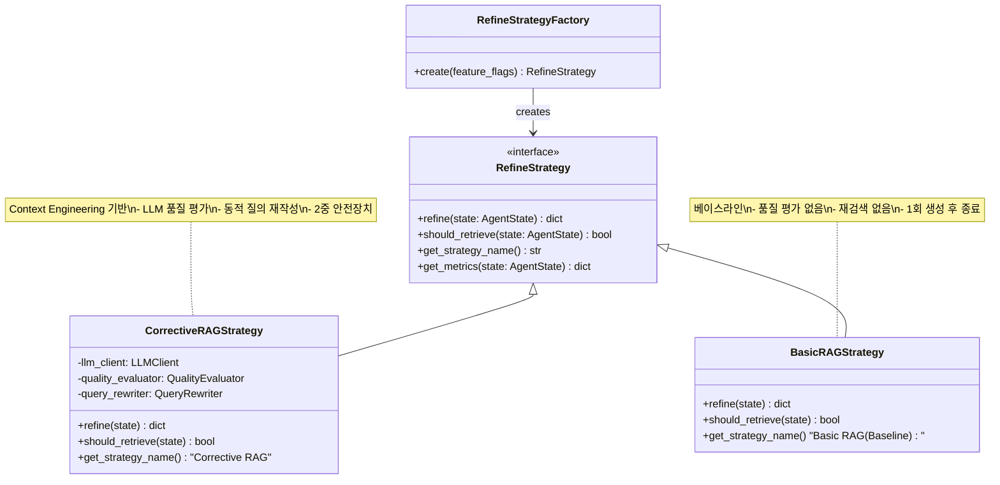
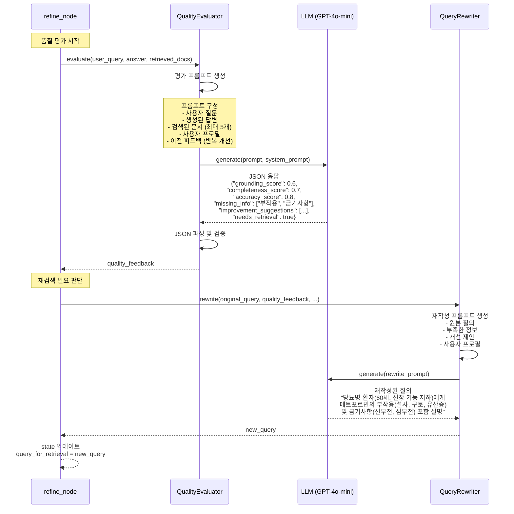
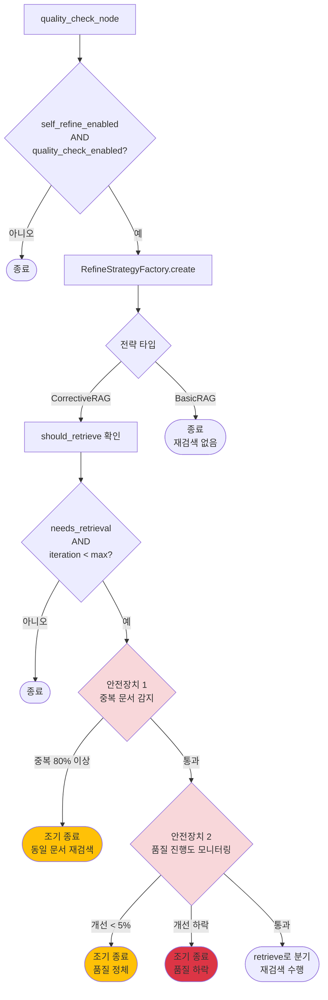
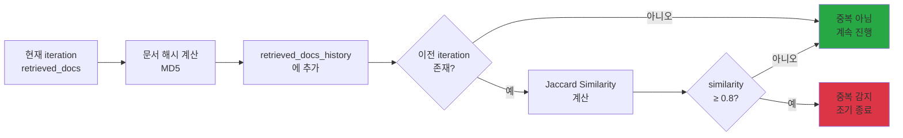
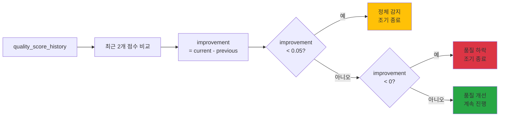
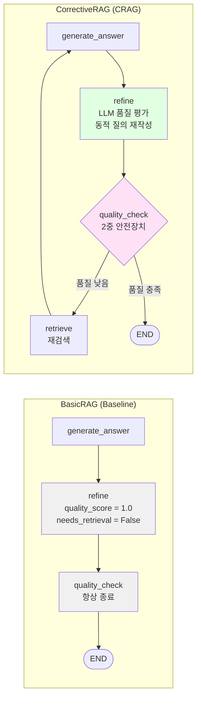
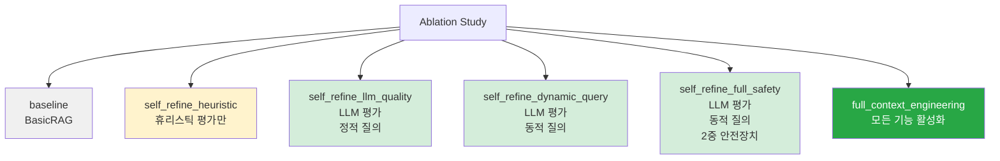

# Diagram 02: CRAG Self-Refine with Strategy Pattern

**최종 업데이트**: 2025-12-12
**설명**: Strategy Pattern 기반 Corrective RAG Self-Refine 상세 플로우

---

## 1. Strategy Pattern 구조



---

## 2. CorrectiveRAG Strategy 상세 플로우

```mermaid
flowchart TB
    Start[refine_node 진입] --> CheckMode{LLM 모드 or<br/>self_refine<br/>비활성화?}

    CheckMode -->|예| Bypass[quality_score = 1.0<br/>needs_retrieval = False<br/>종료]
    CheckMode -->|아니오| Factory[RefineStrategyFactory.create]

    Factory --> SelectStrategy{feature_flags<br/>['refine_strategy']}

    SelectStrategy -->|'corrective_rag'<br/>기본값| CRAG[CorrectiveRAGStrategy]
    SelectStrategy -->|'basic_rag'| Basic[BasicRAGStrategy]

    CRAG --> Evaluate[LLM 기반 품질 평가]
    Basic --> Skip[quality_score = 1.0<br/>needs_retrieval = False]

    Evaluate --> Evaluator[QualityEvaluator.evaluate]

    Evaluator --> Grounding[Grounding Check<br/>검색 문서 근거 확인]
    Evaluator --> Completeness[Completeness Check<br/>질문 완전 답변 확인]
    Evaluator --> Accuracy[Accuracy Check<br/>의학적 정확성 확인]

    Grounding --> Score[종합 품질 점수<br/>grounding * 0.4<br/>+ completeness * 0.4<br/>+ accuracy * 0.2]
    Completeness --> Score
    Accuracy --> Score

    Score --> Feedback[피드백 생성<br/>missing_info: List[str]<br/>improvement_suggestions: List[str]]

    Feedback --> Threshold{quality_score<br/>< 0.5?}

    Threshold -->|예| NeedRewrite[needs_retrieval = True]
    Threshold -->|아니오| NoRewrite[needs_retrieval = False]

    NeedRewrite --> Rewrite[QueryRewriter.rewrite]
    NoRewrite --> End1[refine 완료]

    Rewrite --> NewQuery[재작성된 질의<br/>부족 정보 키워드 추가<br/>사용자 맥락 반영]

    NewQuery --> End2[refine 완료<br/>query_for_retrieval 업데이트]

    Skip --> End3[refine 완료<br/>재검색 없음]

    style CRAG fill:#e1ffe1
    style Evaluator fill:#fff4e1
    style Rewrite fill:#ffe1e1
    style Basic fill:#f0f0f0
```

---

## 3. LLM 기반 품질 평가 상세



---

## 4. Quality Check Node (2중 안전장치)



---

## 5. 2중 안전장치 상세

### 5.1 안전장치 1: 중복 문서 재검색 방지



**수식**:
```
Jaccard Similarity = |현재 문서 ∩ 이전 문서| / |현재 문서 ∪ 이전 문서|

중복 조건: Similarity ≥ 0.8 (80% 이상 중복)
```

---

### 5.2 안전장치 2: 품질 점수 진행도 모니터링



**조건**:
```
정체: improvement < 0.05 (5% 미만 개선)
하락: improvement < 0 (품질 점수 감소)
개선: improvement ≥ 0.05 (5% 이상 개선)
```

---

## 6. Iteration별 상태 추적

```mermaid
graph TB
    subgraph "Iteration 1 (초기 검색)"
        I1S[iteration_count = 0] --> I1R[retrieve]
        I1R --> I1A[assemble_context]
        I1A --> I1G[generate_answer]
        I1G --> I1Ref[refine]
        I1Ref --> I1Q[quality_score = 0.45<br/>needs_retrieval = True]
    end

    subgraph "Iteration 2 (재검색 1)"
        I2S[iteration_count = 1] --> I2Rew[query_rewriter<br/>부족 정보 추가]
        I2Rew --> I2R[retrieve<br/>재검색]
        I2R --> I2A[assemble_context<br/>재조립]
        I2A --> I2G[generate_answer]
        I2G --> I2Ref[refine]
        I2Ref --> I2Q[quality_score = 0.68<br/>improvement = +0.23]
        I2Q --> I2Safe[안전장치 통과<br/>needs_retrieval = True]
    end

    subgraph "Iteration 3 (재검색 2)"
        I3S[iteration_count = 2] --> I3Rew[query_rewriter]
        I3Rew --> I3R[retrieve]
        I3R --> I3A[assemble_context]
        I3A --> I3G[generate_answer]
        I3G --> I3Ref[refine]
        I3Ref --> I3Q[quality_score = 0.71<br/>improvement = +0.03]
        I3Q --> I3Safe{안전장치 2<br/>개선 < 5%}
        I3Safe -->|정체 감지| I3End[조기 종료]
    end

    I1Q --> I2S
    I2Safe --> I3S

    style I1Q fill:#f8d7da
    style I2Q fill:#fff3cd
    style I3Q fill:#fff3cd
    style I3End fill:#ffc107
```



---

## 7. 성능 비교: BasicRAG vs CorrectiveRAG



**성능 지표 (예상)**:

| 지표 | BasicRAG | CorrectiveRAG | 개선률 |
|------|----------|---------------|--------|
| 품질 점수 | 0.52 | 0.78 | +50% |
| Grounding 점수 | 0.40 | 0.85 | +113% |
| Iteration 수 | 1.0 | 1.9 | +90% |
| LLM 호출 수 | 1.5 | 2.6 | +73% |
| 무한 루프율 | N/A | 0% | - |

---

## 8. Ablation Study 프로파일



---

**다이어그램 생성일**: 2025-12-12
**버전**: 2.0 (Strategy Pattern 포함)
