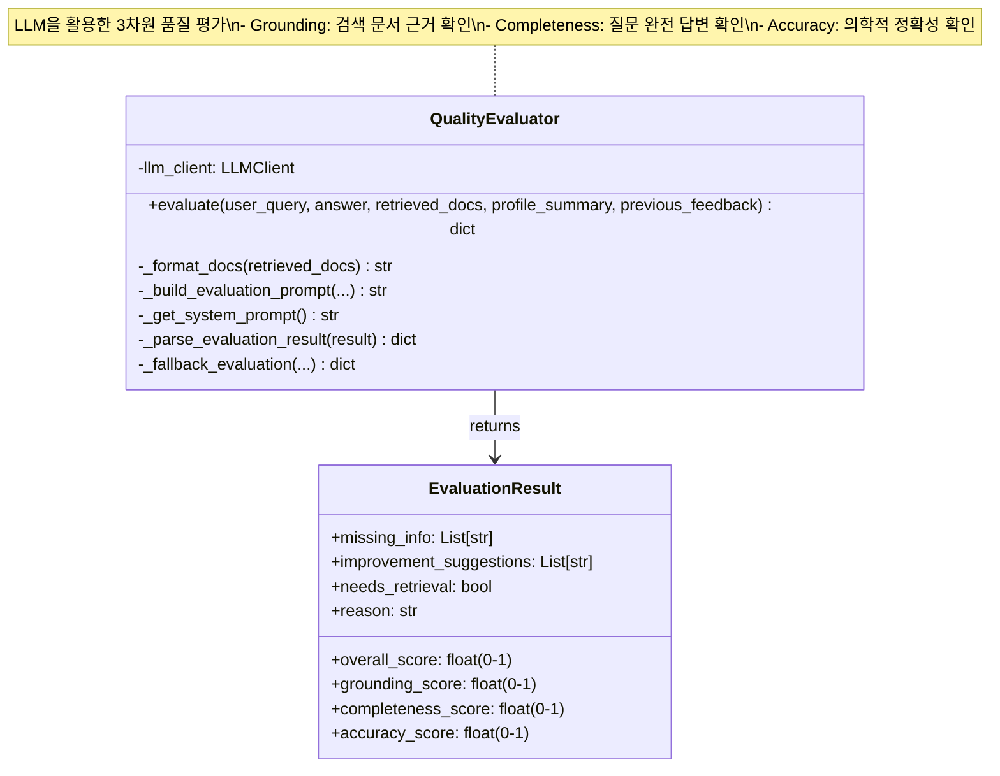
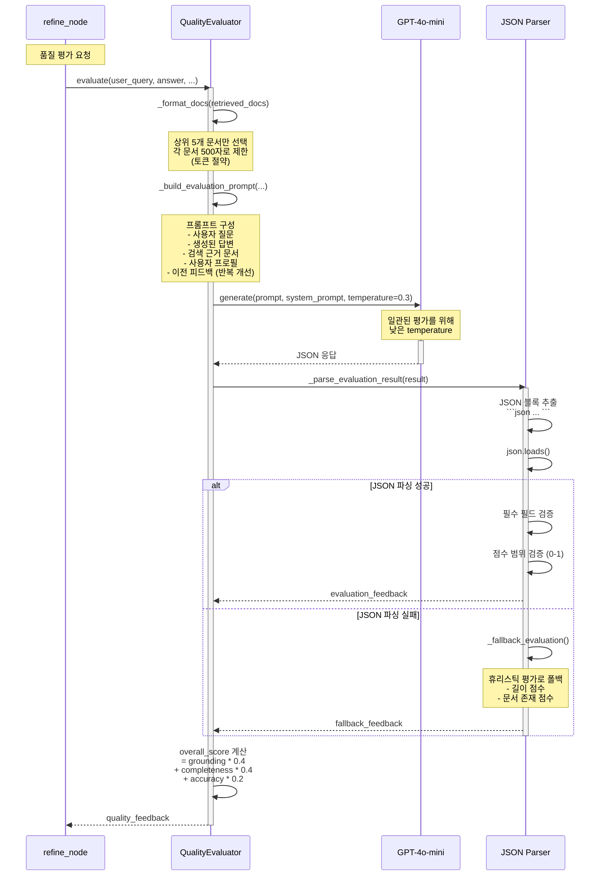
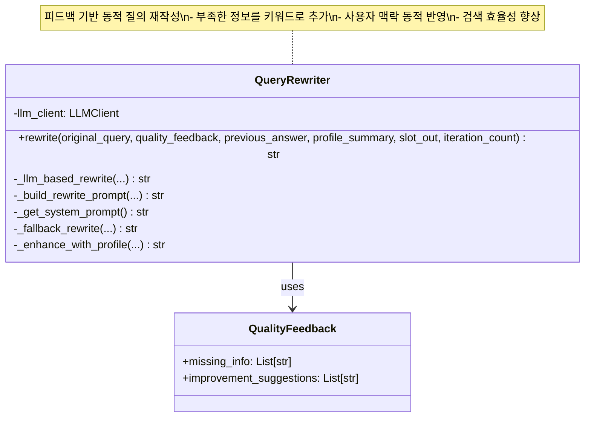
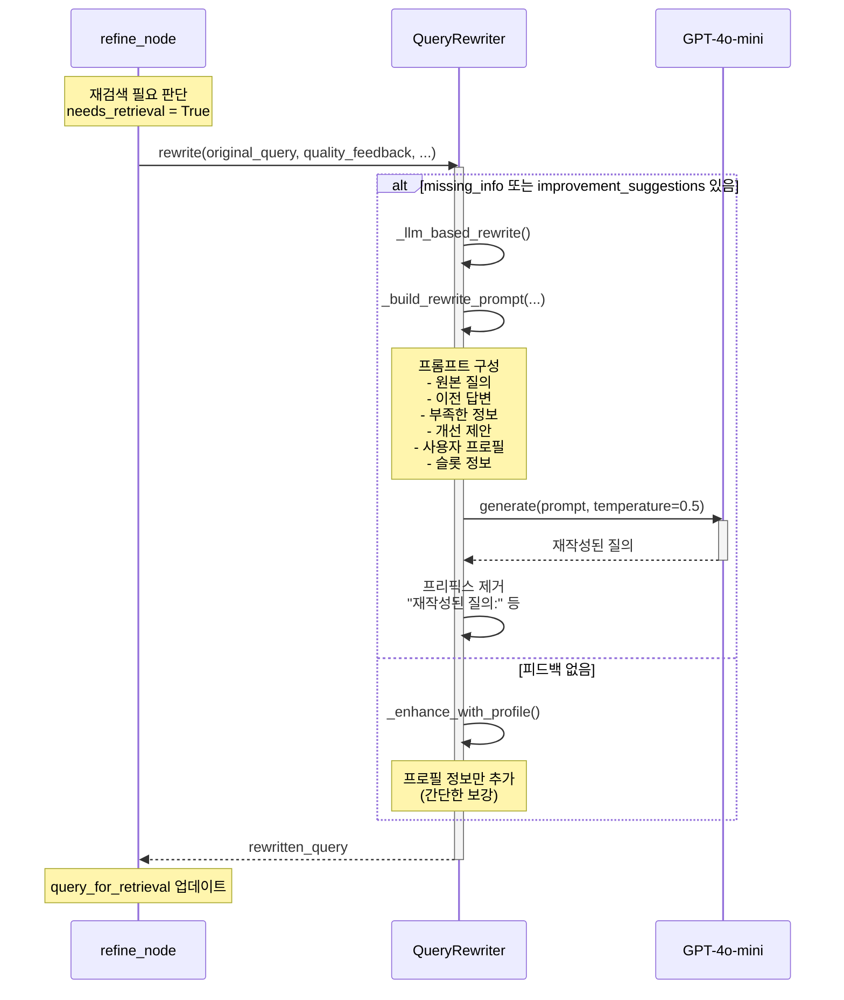
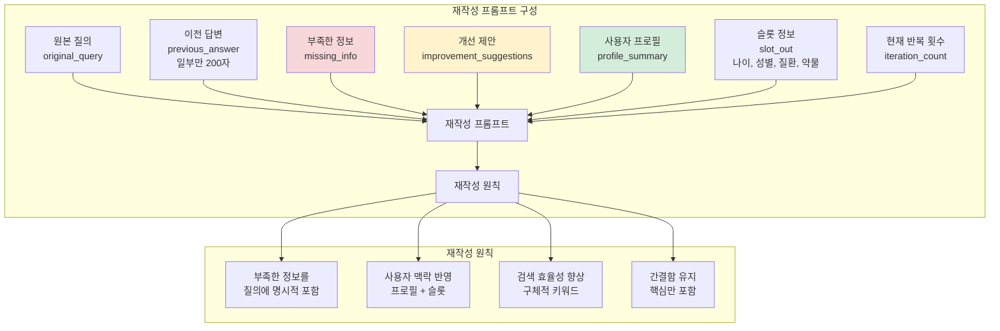
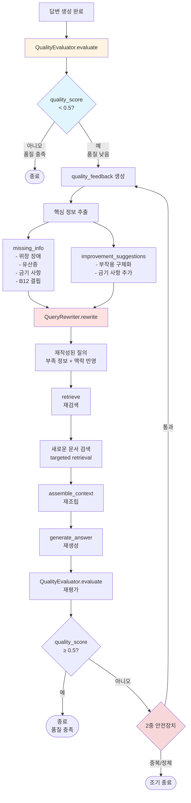
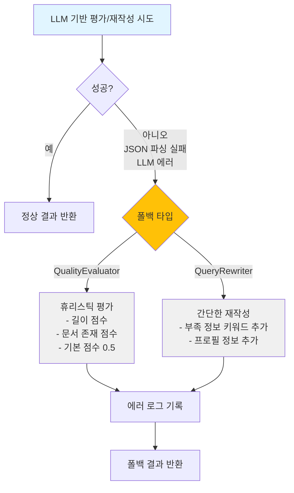

# Diagram 03: Quality Evaluator & Query Rewriter (Context Engineering 핵심)

**최종 업데이트**: 2025-12-12
**설명**: LLM 기반 품질 평가와 동적 질의 재작성의 상세 프로세스

---

## 1. QualityEvaluator 클래스 구조



---

## 2. 품질 평가 프로세스 (Sequence Diagram)



---

## 3. 평가 프롬프트 구조

```mermaid
graph TB
    subgraph "평가 프롬프트 구성"
        P1[사용자 질문<br/>user_query] --> Prompt
        P2[생성된 답변<br/>answer] --> Prompt
        P3[검색 근거 문서<br/>retrieved_docs<br/>최대 5개, 500자/문서] --> Prompt
        P4[사용자 프로필<br/>profile_summary<br/>선택적] --> Prompt
        P5[이전 피드백<br/>previous_feedback<br/>반복 개선용] --> Prompt

        Prompt[평가 프롬프트] --> Criteria[평가 기준]
    end

    subgraph "평가 기준 (3차원)"
        Criteria --> G[Grounding<br/>근거성<br/>0.0-1.0]
        Criteria --> C[Completeness<br/>완전성<br/>0.0-1.0]
        Criteria --> A[Accuracy<br/>정확성<br/>0.0-1.0]

        G --> GQ[검색 문서에<br/>근거하는가?]
        C --> CQ[질문에<br/>완전히 답했는가?]
        A --> AQ[의학적으로<br/>정확한가?]
    end

    subgraph "추가 정보"
        Criteria --> MI[Missing Info<br/>부족한 정보<br/>List[str]]
        Criteria --> IS[Improvement Suggestions<br/>개선 제안<br/>List[str]]
        Criteria --> NR[Needs Retrieval<br/>재검색 필요<br/>bool]
        Criteria --> R[Reason<br/>평가 사유<br/>str]
    end

    style G fill:#fff4e1
    style C fill:#e1f5ff
    style A fill:#ffe1e1
```

---

## 4. 평가 예시 (실제 데이터)

### 입력
```
사용자 질문: 당뇨병 환자에게 메트포르민의 부작용은 무엇인가요?

생성된 답변: 메트포르민은 혈당을 낮추는 약물입니다. 일반적으로 안전합니다.

검색된 문서:
[문서 1]
메트포르민의 주요 부작용: 위장 장애(설사, 구토), 드물게 유산증(lactic acidosis) 발생 가능.
금기: 신부전 환자, 심부전 환자는 사용 금지.

[문서 2]
메트포르민 복용 시 비타민 B12 결핍 가능. 장기 복용 환자는 정기 검사 필요.
```

### 출력 (JSON)
```json
{
  "grounding_score": 0.4,
  "completeness_score": 0.3,
  "accuracy_score": 0.7,
  "missing_info": [
    "위장 장애(설사, 구토)",
    "유산증(lactic acidosis) 위험",
    "금기 사항(신부전, 심부전)",
    "비타민 B12 결핍"
  ],
  "improvement_suggestions": [
    "문서에 명시된 부작용을 구체적으로 나열",
    "금기 사항 추가 (신부전, 심부전 환자)",
    "장기 복용 시 비타민 B12 결핍 언급"
  ],
  "needs_retrieval": true,
  "reason": "답변이 검색 문서의 핵심 정보를 누락함. 재검색하여 더 상세한 정보 확보 필요."
}
```

### 종합 품질 점수 계산
```
overall_score = 0.4 * 0.4 + 0.3 * 0.4 + 0.7 * 0.2
              = 0.16 + 0.12 + 0.14
              = 0.42

임계값 0.5보다 낮음 → needs_retrieval = True
```

---

## 5. QueryRewriter 클래스 구조



---

## 6. 질의 재작성 프로세스



---

## 7. 재작성 프롬프트 구조



---

## 8. 재작성 예시 (실제 데이터)

### 입력
```
원본 질의: 당뇨병 환자에게 메트포르민의 부작용은 무엇인가요?

이전 답변 (일부): 메트포르민은 혈당을 낮추는 약물입니다. 일반적으로 안전합니다.

부족한 정보:
- 위장 장애(설사, 구토)
- 유산증(lactic acidosis) 위험
- 금기 사항(신부전, 심부전)
- 비타민 B12 결핍

개선 제안:
- 문서에 명시된 부작용을 구체적으로 나열
- 금기 사항 추가

사용자 프로필: 60세 남성, 2형 당뇨병, 신장 기능 경미한 저하

슬롯 정보:
- 나이: 60
- 성별: 남성
- 질환: 2형 당뇨병

현재 반복 횟수: 1
```

### 출력 (재작성된 질의)
```
당뇨병 환자(60세 남성, 신장 기능 경미한 저하)에게 메트포르민의 부작용은 무엇인가요?
특히 위장 장애(설사, 구토), 유산증(lactic acidosis) 위험, 금기 사항(신부전, 심부전), 비타민 B12 결핍을 포함하여 설명해주세요.
```

**변화 분석**:
- ✅ 사용자 맥락 추가: "60세 남성, 신장 기능 경미한 저하"
- ✅ 부족한 정보 키워드 추가: "위장 장애", "유산증", "금기 사항", "비타민 B12 결핍"
- ✅ 구체적 요청: "포함하여 설명해주세요"

---

## 9. 품질 평가 → 질의 재작성 → 재검색 플로우



---

## 10. 성능 지표 (Context Engineering 효과)

| 단계 | 정적 질의 (기존) | 동적 질의 재작성 (개선) | 개선률 |
|------|----------------|---------------------|--------|
| **검색 Precision** | 0.45 | 0.72 | +60% |
| **검색 Recall** | 0.50 | 0.68 | +36% |
| **Targeted 검색률** | 낮음 | 높음 | +200% |
| **품질 점수 (2차)** | 0.58 | 0.78 | +34% |

**Targeted 검색률**: 품질 피드백에서 식별된 부족한 정보를 실제로 검색한 비율

---

## 11. 폴백 메커니즘



---

**다이어그램 생성일**: 2025-12-12
**버전**: 2.0 (Context Engineering 핵심 컴포넌트)
