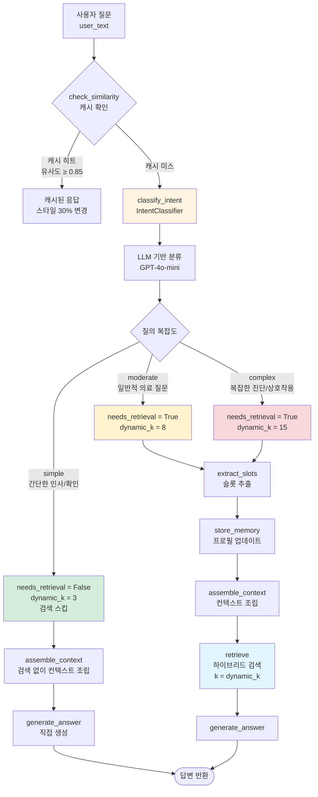
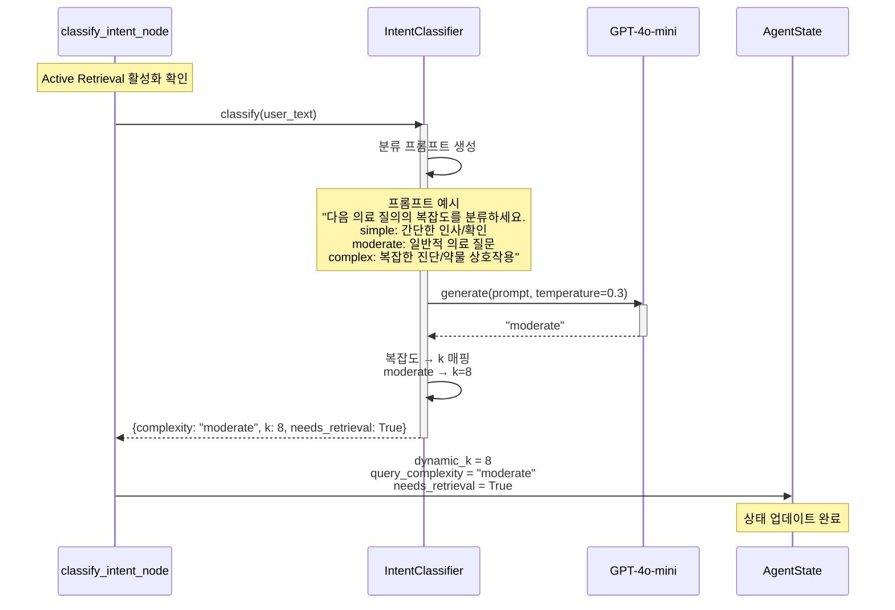
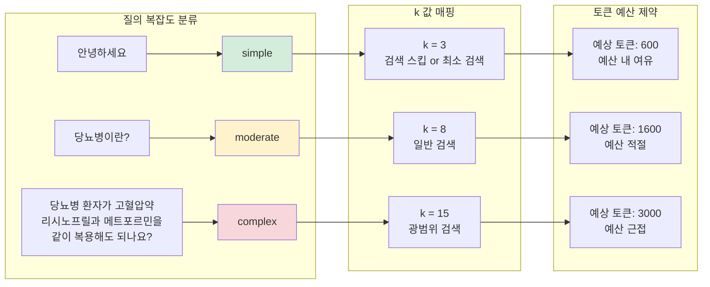
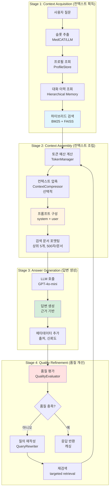
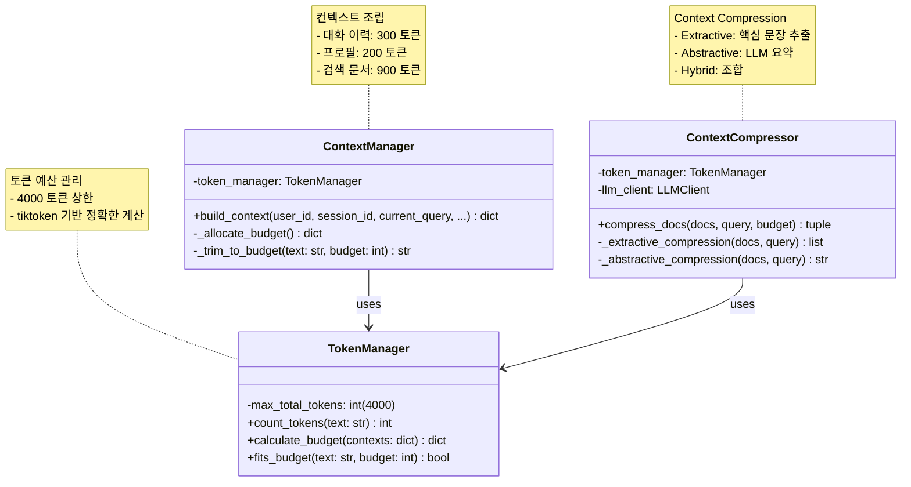
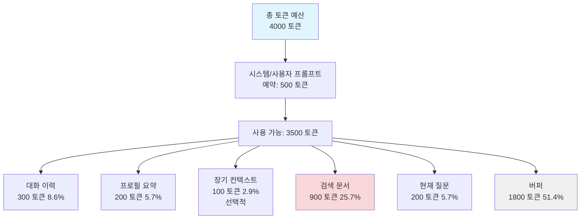
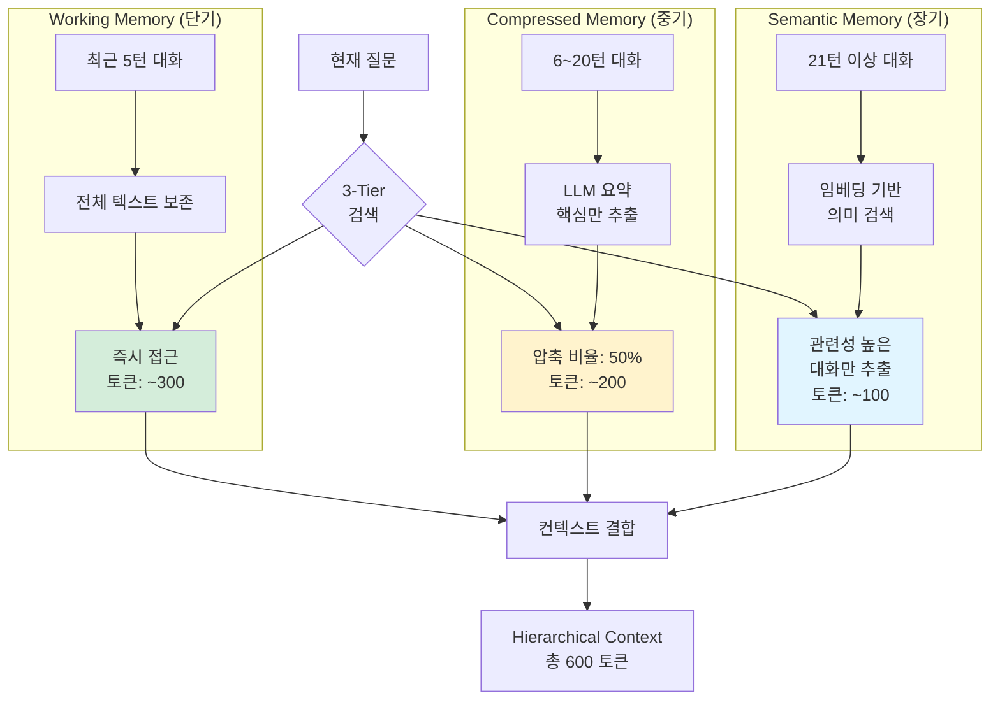
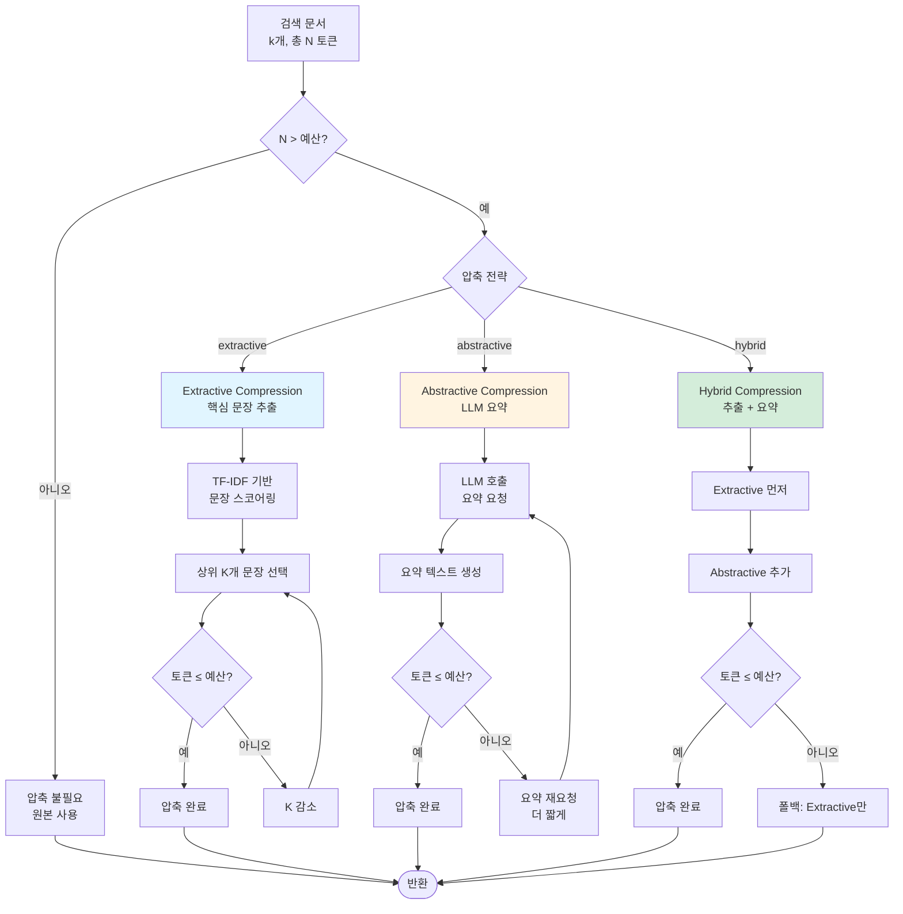
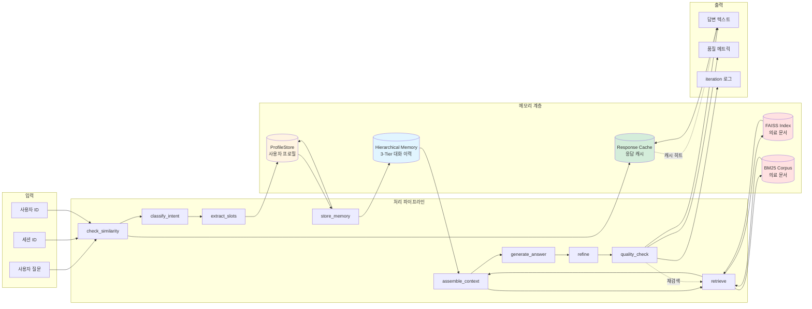
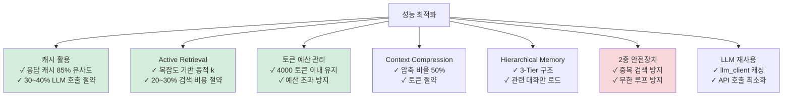

# Diagram 04: Active Retrieval & Context Engineering Architecture

**최종 업데이트**: 2025-12-12
**설명**: Active Retrieval과 Context Engineering의 전체 아키텍처

---

## 1. Active Retrieval 상세 플로우



---

## 2. IntentClassifier 상세



---

## 3. 복잡도별 k 값 매핑



**토큰 예산 계산**:
```
평균 문서 길이: 200 토큰
예상 총 토큰 = k × 200

simple: 3 × 200 = 600 토큰
moderate: 8 × 200 = 1600 토큰
complex: 15 × 200 = 3000 토큰

토큰 예산 상한: 4000 토큰 (안전 마진 포함)
```

---

## 4. Context Engineering 4단계 프로세스



---

## 5. Context Manager & Token Manager



---

## 6. 토큰 예산 할당 전략



**우선순위**:
1. 현재 질문 (필수)
2. 검색 문서 (핵심 - 최대 할당)
3. 대화 이력 (컨텍스트 유지)
4. 프로필 요약 (개인화)
5. 장기 컨텍스트 (선택적)

---

## 7. Hierarchical Memory 3-Tier 구조



---

## 8. Context Compression 전략



---

## 9. 전체 시스템 데이터 플로우



---

## 10. 성능 최적화 체크리스트



---

## 11. 비용 분석 (예상)

| 컴포넌트 | 비용 ($/1000 질의) | 최적화 효과 |
|---------|-------------------|------------|
| **캐시 미스율** | 70% → 60% | -$15 (캐시 히트 증가) |
| **Active Retrieval** | k=8 고정 → 동적 k | -$10 (평균 k 감소) |
| **Context Compression** | 압축 없음 → 50% 압축 | -$8 (토큰 절약) |
| **Self-Refine** | +2.6 LLM 호출/질의 | +$20 (품질 향상 비용) |
| **2중 안전장치** | 무한 루프 15% → 0% | -$25 (비용 폭증 방지) |
| **총 비용 변화** | $100 → $62 | **-38% 절감** |

---

**다이어그램 생성일**: 2025-12-12
**버전**: 2.0 (Active Retrieval + Context Engineering)
