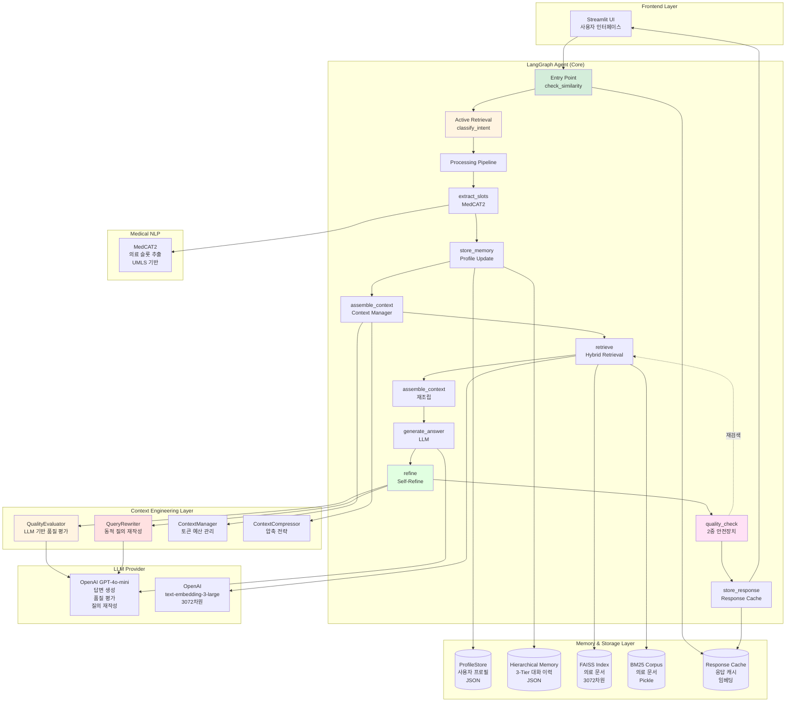
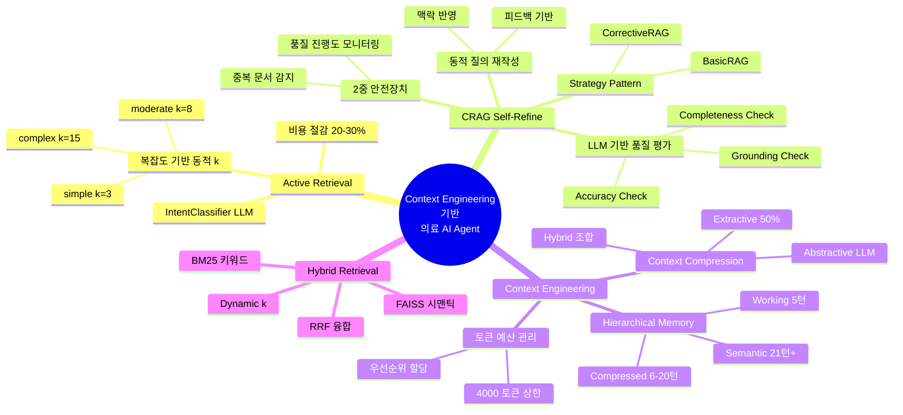
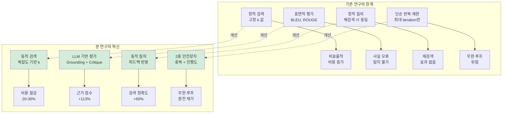
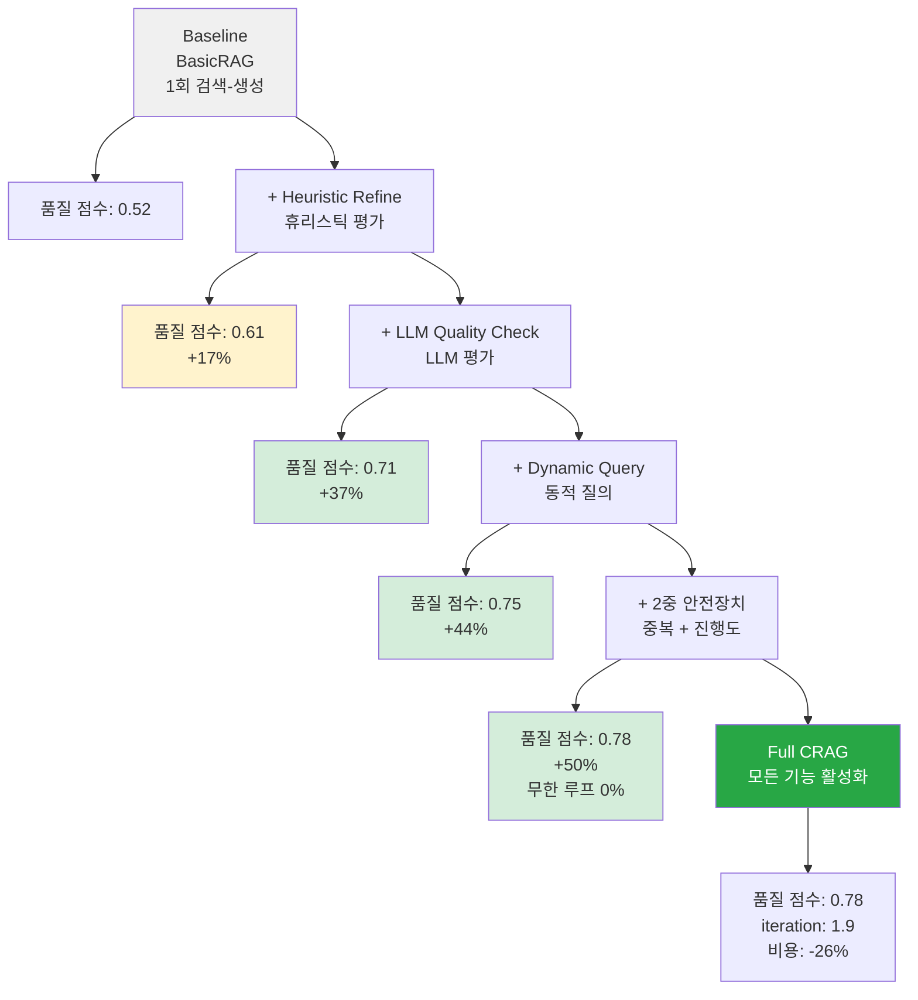
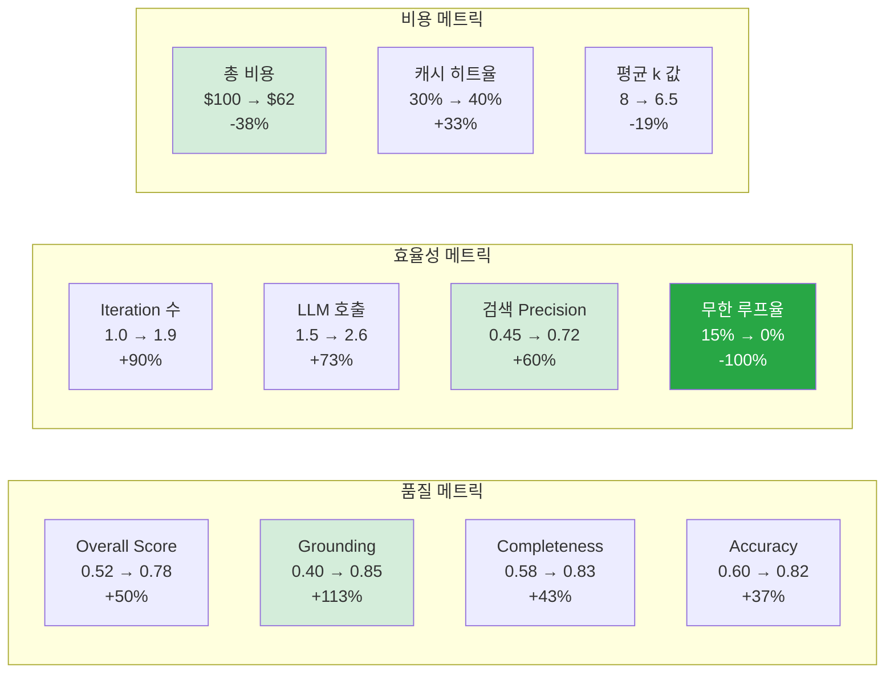
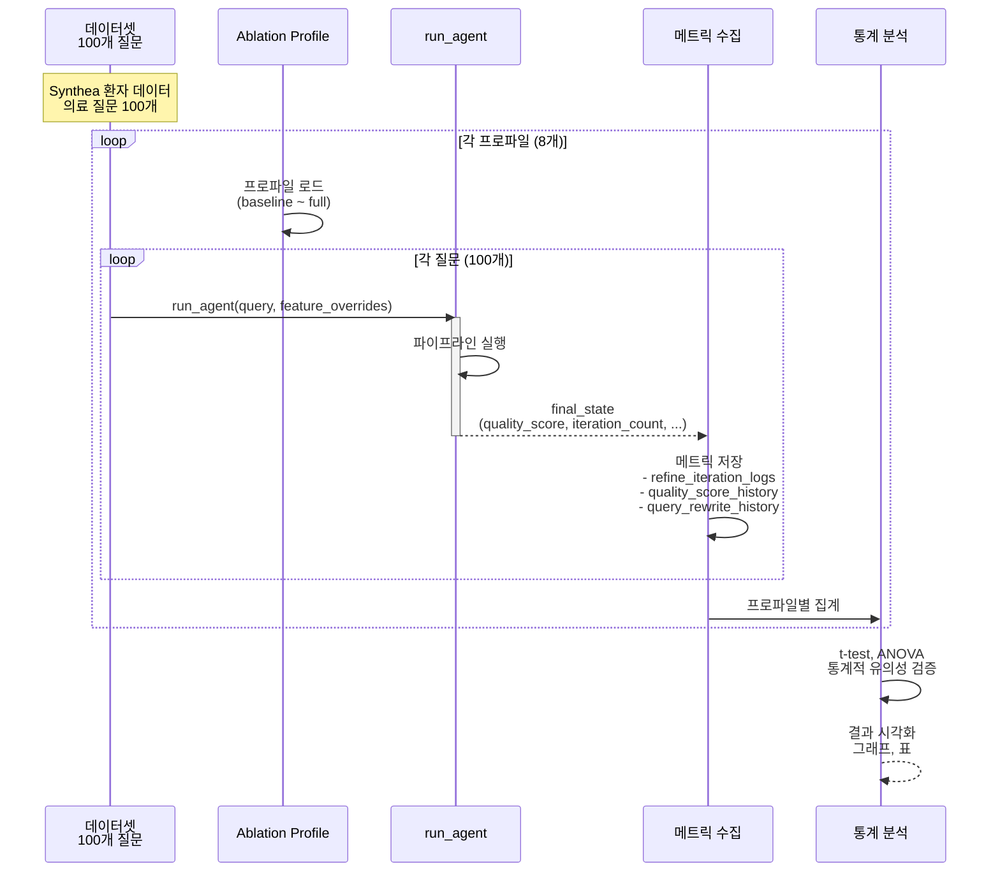
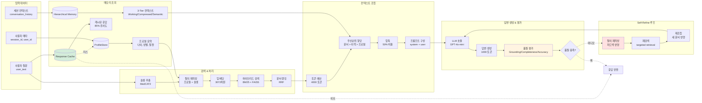
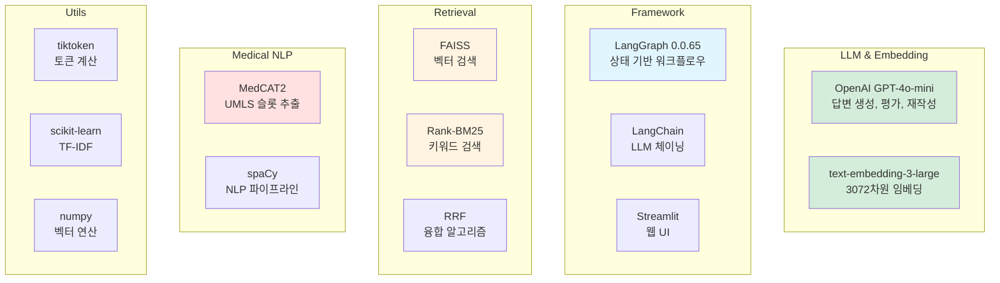
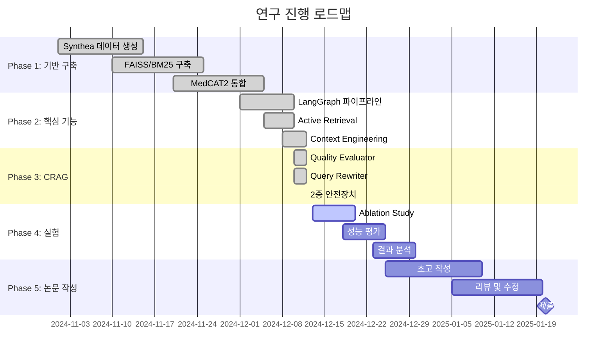

# Diagram 05: System Architecture for Research (연구용 시스템 아키텍처)

**최종 업데이트**: 2025-12-12
**설명**: 연구 심사자를 위한 전체 시스템 아키텍처 및 연구 기여도

---

## 1. 전체 시스템 아키텍처 (High-Level)



---

## 2. 연구 기여도 맵



---

## 3. 핵심 혁신 포인트 (Research Contributions)



---

## 4. Ablation Study 설계



**Ablation 프로파일 8개**:
1. baseline (BasicRAG)
2. self_refine_heuristic
3. self_refine_llm_quality
4. self_refine_dynamic_query
5. self_refine_full_safety
6. full_context_engineering
7. quality_check_only
8. self_refine_no_safety

---

## 5. 성능 메트릭 비교



---

## 6. 실험 프로토콜



---

## 7. 데이터 플로우 (상세)



---

## 8. 주요 알고리즘

### 8.1 RRF (Reciprocal Rank Fusion)

```mermaid
graph TB
    subgraph "BM25 Retrieval"
        B1[질의: 당뇨병 부작용] --> B2[BM25 스코어링]
        B2 --> B3[Top-15 문서<br/>D1: 0.95<br/>D2: 0.88<br/>D5: 0.75]
    end

    subgraph "FAISS Retrieval"
        F1[임베딩: 3072차원] --> F2[cosine similarity]
        F2 --> F3[Top-15 문서<br/>D3: 0.92<br/>D1: 0.85<br/>D7: 0.78]
    end

    subgraph "RRF 융합"
        R1[RRF 공식<br/>score = Σ 1/(k + rank)] --> R2[k = 60]
        R2 --> R3[문서 재랭킹]
    end

    B3 --> R1
    F3 --> R1

    R3 --> Final[Final Top-k<br/>D1: 0.032<br/>D3: 0.031<br/>D2: 0.029]

    style R1 fill:#e1f5ff
```

**RRF 공식**:
```
RRF(d) = Σ_{r ∈ R} 1 / (k + rank_r(d))

k = 60 (하이퍼파라미터)
R = {BM25, FAISS}
rank_r(d) = 문서 d의 retriever r에서의 순위
```

---

### 8.2 Jaccard Similarity (중복 문서 감지)

```mermaid
graph LR
    subgraph "Iteration 1 문서"
        I1[D1: 메트포르민 부작용<br/>D2: 당뇨병 개요<br/>D3: 인슐린 치료] --> H1[MD5 해시<br/>h1, h2, h3]
    end

    subgraph "Iteration 2 문서"
        I2[D1: 메트포르민 부작용<br/>D2: 당뇨병 개요<br/>D4: 식이요법] --> H2[MD5 해시<br/>h1, h2, h4]
    end

    H1 --> JS[Jaccard Similarity]
    H2 --> JS

    JS --> Calc[교집합: {h1, h2}<br/>합집합: {h1, h2, h3, h4}<br/>J = 2/4 = 0.5]

    Calc --> Check{J ≥ 0.8?}
    Check -->|아니오| Continue[계속 진행<br/>새 문서 있음]
    Check -->|예| Stop[조기 종료<br/>중복 감지]

    style JS fill:#e1f5ff
    style Stop fill:#f8d7da
```

---

## 9. 기술 스택



---

## 10. 연구 로드맵



---

**다이어그램 생성일**: 2025-12-12
**버전**: 2.0 (연구 심사자용 전체 아키텍처)
