# [추가 다이어그램 C] RAG 발전 타임라인 (2020-2025)

**섹션**: 제2장 관련 연구 및 배경 지식  
**용도**: RAG 기술의 진화 과정과 본 연구의 위치를 시각화

```mermaid
graph TB
    %% 전체 그래프 스타일 설정
    linkStyle default interpolate basis

    %% ---------------------------------------------------------
    %% 1. 연도별 서브그래프 정의 (내부를 가로형 LR로 변경하여 높이 절약)
    %% ---------------------------------------------------------
    
    subgraph Y20_ZONE ["2020년: RAG의 탄생"]
        direction LR
        Y2020[RAG 탄생<br/>Lewis et al.]
        Y2020_DESC["기본 RAG:<br/>Retrieve → Generate<br/>일방향 파이프라인"]
        Y2020 --> Y2020_DESC
    end

    subgraph Y21_ZONE ["2021년: 개념 확장"]
        direction LR
        Y2021[Self-RAG 개념]
        Y2021_DESC["자기 평가 메커니즘<br/>초기 아이디어"]
        Y2021 --> Y2021_DESC
    end

    subgraph Y22_ZONE ["2022년: 도메인 특화 및 동적 검색"]
        direction TB
        %% 내부 레이아웃을 위한 보이지 않는 컨테이너
        subgraph Y22_NODES [ ]
            direction LR
            Y2022A[Active RAG<br/>Jiang et al.]
            Y2022B[의료 RAG 적용<br/>초기 시도]
        end
        Y2022_DESC["동적 검색 필요성 인식 / 도메인 특화 시작"]
        Y22_NODES --> Y2022_DESC
    end

    subgraph Y23_ZONE ["2023년: 품질 평가 및 정량화"]
        direction TB
        subgraph Y23_NODES [ ]
            direction LR
            Y2023A[CRAG<br/>Yan et al.]
            Y2023B[Self-Refine<br/>Madaan et al.]
            Y2023C[RAGAS 평가<br/>Es et al.]
        end
        Y2023_DESC["품질 평가 및 교정 / 정량적 메트릭 확립"]
        Y23_NODES --> Y2023_DESC
    end

    subgraph Y24_ZONE ["2024년: 에이전트 및 맥락 공학"]
        direction TB
        subgraph Y24_NODES [ ]
            direction LR
            Y2024A[LangGraph<br/>LangChain]
            Y2024B[Context Eng.<br/>개념 정립]
            Y2024C[Multi-Agent<br/>Workflow]
        end
        Y2024_DESC["순환 아키텍처 지원 / 맥락 관리 중요성 대두"]
        Y24_NODES --> Y2024_DESC
    end

    subgraph Y25_ZONE ["2025년 (본 연구): 의료 특화 AI Agent"]
        direction LR
        Y2025[Context Engineering<br/>기반 의학지식<br/>AI Agent]
        Y2025_FEATURES["✓ 4단계 CE 체계화<br/>✓ LangGraph 순환 구조<br/>✓ LLM Judge 품질 보증<br/>✓ Active Retrieval 의료 특화"]
        Y2025 --> Y2025_FEATURES
    end

    %% ---------------------------------------------------------
    %% 2. 연도 간 연결 (중앙 흐름 유지)
    %% ---------------------------------------------------------
    
    Y20_ZONE ==> Y21_ZONE
    Y21_ZONE ==> Y22_ZONE
    Y22_ZONE ==> Y23_ZONE
    Y23_ZONE ==> Y24_ZONE
    Y24_ZONE ==> Y25_ZONE

    %% ---------------------------------------------------------
    %% 3. 스타일 정의
    %% ---------------------------------------------------------
    
    classDef default fill:#fff,stroke:#333,stroke-width:1px;
    
    %% 연도별 색상 적용
    style Y2020 fill:#e3f2fd,stroke:#1565c0
    style Y2020_DESC fill:#fff,stroke:none
    
    style Y2021 fill:#e8f5e9,stroke:#2e7d32
    style Y2021_DESC fill:#fff,stroke:none
    
    style Y2022A fill:#fff3e0,stroke:#ef6c00
    style Y2022B fill:#fff3e0,stroke:#ef6c00
    style Y2022_DESC fill:#fff,stroke:none
    
    style Y2023A fill:#f3e5f5,stroke:#7b1fa2
    style Y2023B fill:#f3e5f5,stroke:#7b1fa2
    style Y2023C fill:#f3e5f5,stroke:#7b1fa2
    style Y2023_DESC fill:#fff,stroke:none
    
    style Y2024A fill:#ffecb3,stroke:#fbc02d
    style Y2024B fill:#ffecb3,stroke:#fbc02d
    style Y2024C fill:#ffecb3,stroke:#fbc02d
    style Y2024_DESC fill:#fff,stroke:none
    
    style Y2025 fill:#ffcdd2,stroke:#c62828,stroke-width:2px
    style Y2025_FEATURES fill:#ffebee,stroke:#c62828,stroke-dasharray: 5 5

    %% 서브그래프(연도 박스) 스타일 - 투명하거나 깔끔하게
    style Y20_ZONE fill:none,stroke:none
    style Y21_ZONE fill:none,stroke:none
    style Y22_ZONE fill:none,stroke:#eee,stroke-width:1px,stroke-dasharray: 2 2
    style Y23_ZONE fill:none,stroke:#eee,stroke-width:1px,stroke-dasharray: 2 2
    style Y24_ZONE fill:none,stroke:#eee,stroke-width:1px,stroke-dasharray: 2 2
    style Y25_ZONE fill:#fff,stroke:#333,stroke-width:2px

    %% 내부 그룹 투명화
    style Y22_NODES fill:none,stroke:none
    style Y23_NODES fill:none,stroke:none
    style Y24_NODES fill:none,stroke:none
```



graph TB
    subgraph "2020년"
        Y2020[RAG 탄생<br/>Lewis et al.]
        Y2020_DESC["기본 RAG:<br/>Retrieve → Generate<br/>일방향 파이프라인"]
        Y2020 --> Y2020_DESC
    end
    
    subgraph "2021년"
        Y2021[Self-RAG 개념 등장]
        Y2021_DESC["자기 평가 메커니즘<br/>초기 아이디어"]
        Y2021 --> Y2021_DESC
    end
    
    subgraph "2022년"
        Y2022A[Active RAG<br/>Jiang et al.]
        Y2022B[의료 RAG 적용<br/>초기 시도]
        Y2022_DESC["동적 검색 필요성 인식<br/>도메인 특화 시작"]
        Y2022A --> Y2022_DESC
        Y2022B --> Y2022_DESC
    end
    
    subgraph "2023년"
        Y2023A[CRAG<br/>Yan et al.]
        Y2023B[Self-Refine<br/>Madaan et al.]
        Y2023C[RAGAS 평가<br/>Es et al.]
        Y2023_DESC["품질 평가 및 교정<br/>정량적 메트릭 확립"]
        Y2023A --> Y2023_DESC
        Y2023B --> Y2023_DESC
        Y2023C --> Y2023_DESC
    end
    
    subgraph "2024년"
        Y2024A[LangGraph 등장<br/>LangChain Team]
        Y2024B[Context Engineering<br/>개념 정립]
        Y2024C[Multi-Agent RAG<br/>복잡한 워크플로우]
        Y2024_DESC["순환 아키텍처 지원<br/>맥락 관리 중요성"]
        Y2024A --> Y2024_DESC
        Y2024B --> Y2024_DESC
        Y2024C --> Y2024_DESC
    end
    
    subgraph "2025년 - 본 연구"
        Y2025[Context Engineering<br/>기반 의학지식<br/>AI Agent]
        Y2025_FEATURES["✓ 4단계 CE 체계화<br/>✓ LangGraph 순환 구조<br/>✓ LLM Judge 품질 보증<br/>✓ Active Retrieval 의료 특화<br/>✓ 이중 안전장치"]
        Y2025 --> Y2025_FEATURES
    end
    
    Y2020 -.발전.-> Y2021
    Y2021 -.발전.-> Y2022A
    Y2022A -.발전.-> Y2023A
    Y2022B -.발전.-> Y2023A
    Y2023A -.발전.-> Y2024A
    Y2023B -.발전.-> Y2024B
    Y2024A -.통합.-> Y2025
    Y2024B -.통합.-> Y2025
    Y2024C -.통합.-> Y2025
    
    style Y2020 fill:#e3f2fd
    style Y2021 fill:#e8f5e9
    style Y2022A fill:#fff3e0
    style Y2022B fill:#fff3e0
    style Y2023A fill:#f3e5f5
    style Y2023B fill:#f3e5f5
    style Y2023C fill:#f3e5f5
    style Y2024A fill:#ffecb3
    style Y2024B fill:#ffecb3
    style Y2024C fill:#ffecb3
    style Y2025 fill:#ffcdd2
    style Y2025_FEATURES fill:#c8e6c9


---

## RAG 기술 발전 타임라인 상세 설명

### 📅 2020년: RAG의 탄생

**핵심 논문**: Lewis, P., et al. (2020). "Retrieval-Augmented Generation for Knowledge-Intensive NLP Tasks." NeurIPS 2020.

**혁신**:
- LLM의 **환각(hallucination) 문제**를 해결하기 위해 외부 지식 검색을 통합
- 기본 구조: **Retrieve (검색) → Generate (생성)**
- 일방향 파이프라인 (한 번 검색, 한 번 생성)

**한계**:
- 검색 품질이 나쁘면 답변도 나쁨 (no feedback loop)
- 고정된 k개 문서만 검색
- 검색 결과의 품질을 평가하지 않음

**의료 적용**:
- 아직 의료 도메인에 적용 사례 없음
- 일반 Q&A, 위키피디아 검색 등에 활용

---

### 📅 2021년: 자기 평가 개념 등장

**배경**:
- RAG의 답변 품질이 검색 결과에 크게 의존함을 인식
- "답변이 잘못되었는지 스스로 판단할 수 있을까?" 질문 제기

**Self-RAG 초기 아이디어**:
- LLM이 자신의 답변을 스스로 평가
- 답변이 부족하면 재검색 또는 재생성
- 하지만 구체적인 구현 방법은 아직 미흡

**한계**:
- 이론적 제안 단계
- 무한 루프 위험성 미해결
- 평가 기준이 휴리스틱 (답변 길이, 키워드 존재 등)

---

### 📅 2022년: 동적 검색과 의료 특화

**Active RAG (Jiang et al., 2023년 arXiv, 개념은 2022년부터)**:
- 모든 질의에 검색이 필요한 것은 아님
- 질의 복잡도에 따라 **검색 여부와 문서 수를 동적으로 조정**
- 예: "안녕하세요" → 검색 불필요, "당뇨병과 고혈압의 상호작용" → 많은 문서 필요

**의료 RAG 초기 시도**:
- 전자건강기록(EHR)을 외부 지식으로 활용
- 의학 논문, 가이드라인을 검색 코퍼스로 사용
- **문제**: 의료 용어의 복잡성, 환자별 맞춤화 부족

**한계**:
- Active RAG는 아직 의료에 특화되지 않음
- 의료 RAG는 단순 검색만 수행 (품질 평가 없음)

---

### 📅 2023년: 품질 평가와 교정의 해

**CRAG (Corrective RAG) - Yan et al., ICLR 2024**:
- 검색 결과의 **품질을 평가**하고, 품질이 낮으면 **교정 조치**
- 3가지 액션:
  1. **Correct**: 검색 결과가 좋음 → 그대로 사용
  2. **Incorrect**: 검색 결과가 나쁨 → 웹 검색으로 확장
  3. **Ambiguous**: 애매함 → 질의 재작성 후 재검색
- 하지만 여전히 **휴리스틱 평가** (키워드 매칭, 점수 임계값)

**Self-Refine (Madaan et al., NeurIPS 2023)**:
- LLM이 자신의 출력을 **반복적으로 개선**
- Feedback → Refine → Feedback 순환
- 초기 답변 → 자기 비판 → 재작성 → 재평가
- 하지만 **일반 텍스트 생성**에 초점 (RAG와 통합 X)

**RAGAS (Es et al., arXiv 2023)**:
- RAG 시스템을 **정량적으로 평가**하는 메트릭 제안
- **Faithfulness** (근거성): 답변이 검색 문서에 근거하는가?
- **Answer Relevance** (관련성): 질문에 잘 답했는가?
- **Context Relevance** (검색 품질): 검색 결과가 관련성 있는가?

**의미**:
- 2023년은 RAG의 **품질 보증**이 중심 주제
- 하지만 CRAG, Self-Refine, RAGAS가 **각각 독립적**으로 제안됨
- 이를 **통합한 시스템**은 아직 없음

---

### 📅 2024년: 순환 아키텍처와 맥락 관리

**LangGraph (LangChain Team, 2023년 말 ~ 2024년 초)**:
- LangChain의 한계 (일방향 체인)를 극복
- **상태 기반 워크플로우**: 각 노드가 상태를 업데이트
- **순환 구조 지원**: Self-Refine 같은 루프를 자연스럽게 구현
- **조건부 엣지**: 동적 라우팅 (if quality < 0.5 then re-retrieve)

**Context Engineering 개념 정립**:
- 단순한 "대화 이력 저장"을 넘어 **체계적 맥락 관리**
- 사용자의 핵심 정보를 **추출 → 저장 → 주입 → 검증**
- 특히 **멀티턴 대화**에서 맥락 손실 방지 중요성 강조

**Multi-Agent RAG**:
- 복잡한 작업을 여러 에이전트가 협력하여 해결
- 예: Planner Agent (계획) + Retriever Agent (검색) + Generator Agent (생성) + Evaluator Agent (평가)
- 하지만 **의료 도메인**에는 아직 본격 적용 안 됨

**의미**:
- RAG가 단순한 "검색 + 생성"에서 **복잡한 워크플로우 시스템**으로 진화
- LangGraph의 등장으로 Self-Refine 같은 순환 구조 구현이 실용화됨

---

### 📅 2025년: 본 연구 - 모든 것의 통합

**본 연구의 혁신 (2025년 12월)**:

**1. Context Engineering 4단계 체계화**
- 기존의 단편적인 맥락 관리를 **4단계 파이프라인**으로 정립
- **추출**: MedCAT2 (UMLS 기반 의학 엔티티)
- **저장**: 6개 슬롯 + 시간 가중치
- **주입**: 동적 프롬프트 조립 (토큰 예산 관리)
- **검증**: LLM Judge (3차원 평가)

**2. LangGraph 기반 순환 아키텍처 (10개 전문 노드)**
- 2024년 LangGraph를 의료 AI Agent에 본격 적용
- check_similarity → classify_intent → extract_slots → ... → quality_check
- **이중 안전장치**로 무한 루프 0% 달성

**3. LLM Judge 기반 품질 보증 (CRAG + Self-Refine 통합)**
- CRAG의 교정 개념 + Self-Refine의 반복 개선 + LLM Judge 평가
- **휴리스틱이 아닌 LLM이 품질 평가** (grounding, completeness, accuracy)
- 품질 피드백 기반 **동적 질의 재작성**

**4. Active Retrieval 의료 특화**
- 2022년 Active RAG 아이디어를 **의료 도메인에 맞게 조정**
- **슬롯 기반 복잡도 추정** (의료 개념 개수로 판단)
- 3단계 분류 (Rule-based → Slot-based → Content-based)
- 동적 k: Greeting(0), Simple(3), Moderate(8), Complex(15)

**5. 응답 캐시 (효율성)**
- 30% 질의를 벡터 유사도 기반으로 즉시 처리
- 레이턴시 -85%, 비용 -99% (캐시 히트 시)

**6. 하이브리드 검색 (BM25 + FAISS + RRF)**
- 키워드 정확성 (BM25) + 의미 이해 (FAISS)
- Precision +30%, Recall +50%

**본 연구의 위치**:
- 2020-2024년의 모든 RAG 혁신을 **하나의 시스템으로 통합**
- 특히 **의료 도메인**에 특화하여 실용성 확보
- **정량적 검증** (Faithfulness +50%, p<0.001)

---

## 타임라인 핵심 흐름 요약

```
2020년: 기본 RAG (일방향)
   ↓
2021년: 자기 평가 아이디어 (이론)
   ↓
2022년: 동적 검색 + 의료 적용 초기
   ↓
2023년: 품질 평가 및 교정 (CRAG, Self-Refine, RAGAS)
   ↓
2024년: 순환 아키텍처 (LangGraph) + 맥락 관리 (Context Engineering)
   ↓
2025년 본 연구: 모든 혁신을 통합 + 의료 특화 + 정량적 검증
```

---

## 각 시기별 핵심 질문과 답변

| 시기 | 핵심 질문 | 해결 방법 | 본 연구와의 관계 |
|------|----------|-----------|----------------|
| **2020년** | RAG를 어떻게 구현하나? | Retrieve → Generate | 기본 구조 채택 |
| **2021년** | 답변 품질을 어떻게 높이나? | 자기 평가 개념 | Self-Refine에 반영 |
| **2022년** | 모든 질의에 검색이 필요한가? | Active RAG 아이디어 | 의료 특화 Active Retrieval |
| **2023년** | 품질을 어떻게 측정하나? | CRAG, RAGAS 메트릭 | LLM Judge + RAGAS 적용 |
| **2024년** | 순환 구조를 어떻게 구현하나? | LangGraph | 10개 노드 워크플로우 |
| **2024년** | 맥락을 어떻게 관리하나? | Context Engineering | 4단계 CE 체계화 |
| **2025년** | 의료 AI에 어떻게 통합하나? | **본 연구** | **전체 통합 + 의료 특화** |

---

## 학술적 기여 (본 연구의 차별점)

1. **통합**: 5년간의 RAG 혁신을 하나의 일관된 시스템으로 통합
2. **의료 특화**: Active Retrieval, Context Engineering을 의료 도메인에 맞게 조정
3. **실용성**: 이중 안전장치, 응답 캐시로 실제 사용 가능한 시스템 구축
4. **정량적 검증**: Ablation Study + 통계적 유의성 검증 (p<0.001)
5. **체계화**: Context Engineering을 4단계 파이프라인으로 명확히 정의

---

**결론**: 본 연구는 단순히 기존 기술을 조합한 것이 아니라, 5년간의 RAG 발전 과정을 체계적으로 통합하고 의료 도메인에 특화하여 실용적이고 검증된 시스템을 구축한 것이다.

